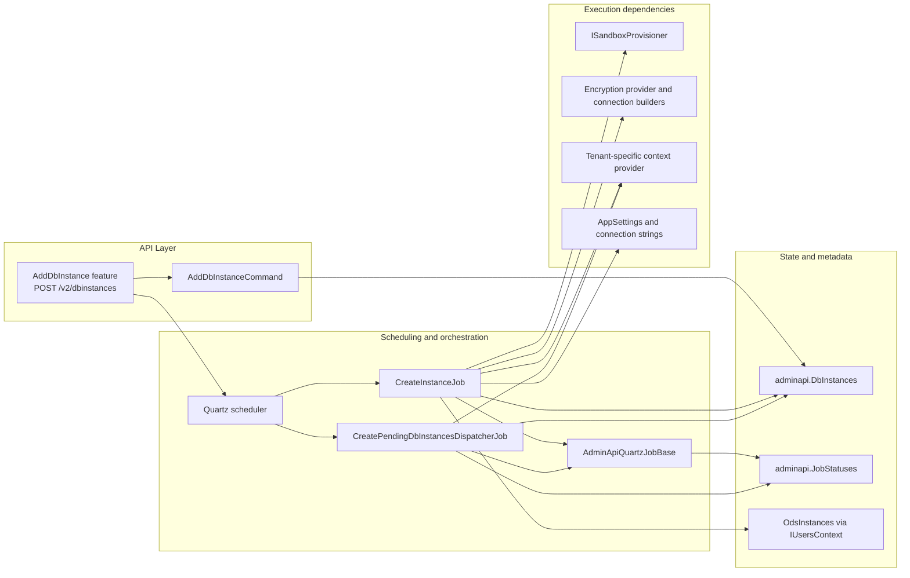
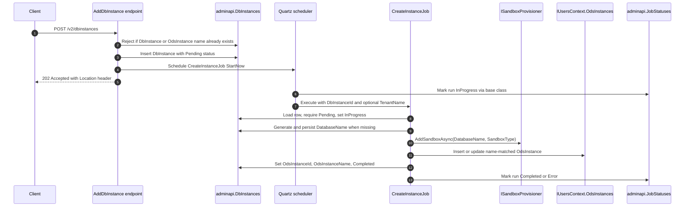
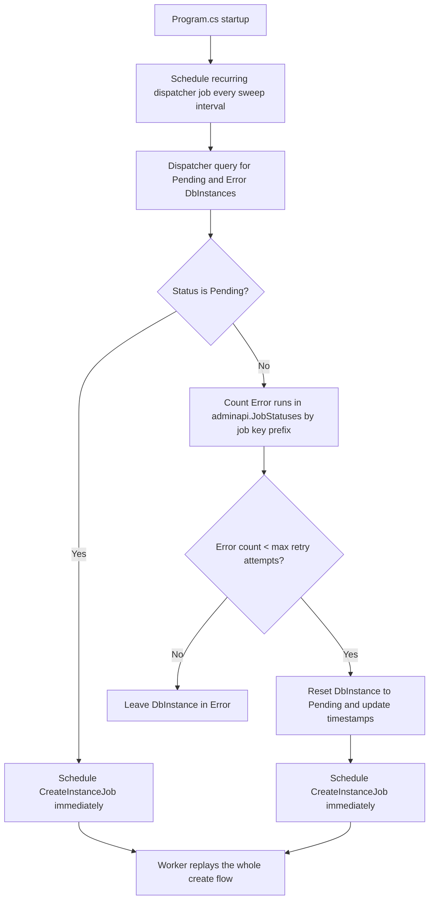

# DbInstance Provisioning Jobs Design

This document is the durable design reference for the `POST /v2/dbinstances` background provisioning pipeline introduced by `ADMINAPI-1369`.

It documents the implemented architecture, runtime flow, configuration, prerequisites, and the technical decisions behind the current `CreateInstanceJob` and `CreatePendingDbInstancesDispatcherJob` behavior.

## Scope

In scope:

* `POST /v2/dbinstances`
* `CreateInstanceJob`
* `CreatePendingDbInstancesDispatcherJob`
* `adminapi.DbInstances` lifecycle transitions
* `adminapi.JobStatuses` tracking through the shared Quartz base
* `OdsInstances` synchronization and reconciliation
* Multi-tenant job identity and tenant-aware execution

Out of scope:

* Delete-instance processing
* Quartz persistent job store migration
* Broader `OdsInstance` validator redesign outside this workflow

## Top-level hierarchy

| Layer | Primary files | Responsibility |
| --- | --- | --- |
| API entry | `Application/EdFi.Ods.AdminApi/Features/DbInstances/AddDbInstance.cs` | Validate input, persist the initial `Pending` `DbInstance`, schedule immediate background work, and return `202 Accepted`. |
| Worker job | `Application/EdFi.Ods.AdminApi/Infrastructure/Services/Jobs/CreateInstanceJob.cs` | Process one `DbInstance` from `Pending` to `Completed` or `Error`. |
| Recovery orchestration | `Application/EdFi.Ods.AdminApi/Infrastructure/Services/Jobs/CreatePendingDbInstancesDispatcherJob.cs`, `Application/EdFi.Ods.AdminApi/Program.cs` | Schedule recurring sweeps, discover retryable records, and enqueue worker jobs. |
| Shared Quartz infrastructure | `Application/EdFi.Ods.AdminApi.Common/Infrastructure/Jobs/AdminApiQuartzJobBase.cs`, `Application/EdFi.Ods.AdminApi.Common/Infrastructure/Jobs/QuartzJobScheduler.cs`, `Application/EdFi.Ods.AdminApi.Common/Infrastructure/Jobs/JobConstants.cs` | Persist `JobStatuses`, apply common job metadata, and avoid duplicate scheduling for recurring jobs. |
| State and external dependencies | `adminapi.DbInstances`, `adminapi.JobStatuses`, `IUsersContext.OdsInstances`, `ISandboxProvisioner`, connection-string builders, encryption provider | Store business state, track executions, provision databases, and create encrypted `OdsInstance` metadata. |

## Core model and invariants

* `DbInstance.DatabaseTemplate` maps to both `SandboxType` and `OdsInstance.InstanceType`.
* `DbInstance.DatabaseName` is generated once as `EdFi_Ods_<normalized DbInstance.Name>_<normalized DbInstance.DatabaseTemplate>` and then reused on retries.
* Spaces in both `DbInstance.Name` and `DbInstance.DatabaseTemplate` are normalized to `_` when building `DbInstance.DatabaseName`.
* Duplicate leading `EdFi_Ods` prefix variants are removed from the normalized `DbInstance.Name` segment, case-insensitively, before composing the final database name.
* Prefix de-duplication applies only to the leading `DbInstance.Name` segment, not to later occurrences inside the user-provided name.
* If the normalized `DbInstance.Name` segment collapses to empty because it only contained a prefix variant, the final database name becomes `EdFi_Ods_<normalized DbInstance.DatabaseTemplate>`.
* `AddDbInstance` rejects requests whose generated database name would exceed 63 characters instead of trimming it.
* `AddDbInstance` rejects requests when the trimmed `DbInstance.Name` already exists in either `adminapi.DbInstances.Name` or `admin.OdsInstances.Name`.
* The synchronized final name is always `DbInstance.Name`.
* The final name is written to both `DbInstance.OdsInstanceName` and `OdsInstance.Name`.
* `OdsInstance.ConnectionString` is derived from the configured `EdFi_Ods` connection-string shape and encrypted with `AppSettings:EncryptionKey`.
* `CreateInstanceJob` only processes `Pending` rows.
* The dispatcher only scans rows in `Pending` or `Error`.
* `AddDbInstance` validates `DbInstance.Name` so only `A-Za-z0-9 _` characters are accepted before background work is scheduled.

## Runtime flow

### Immediate API flow

`POST /v2/dbinstances` is intentionally asynchronous. The endpoint persists the request, schedules `CreateInstanceJob`, and returns immediately. The heavy work stays in the worker so the API contract remains `202 Accepted` even when provisioning takes minutes.

### Recovery and retry flow

The dispatcher owns recurring discovery and retry gating. `CreateInstanceJob` stays focused on one `Pending` row at a time and does not decide by itself when an `Error` row is eligible to replay.

## Job identity and payloads

### Worker job identity

`CreateInstanceJob` uses per-record Quartz identities:

* single-tenant: `CreateInstanceJob-{DbInstanceId}`
* multi-tenant: `CreateInstanceJob-{TenantName}-{DbInstanceId}`

Payload:

* `DbInstanceId`
* `TenantName` when multi-tenancy is enabled

### Dispatcher job identity

The recurring dispatcher is scheduled from `Program.cs`:

* single-tenant: `CreatePendingDbInstancesDispatcherJob`
* multi-tenant: `CreatePendingDbInstancesDispatcherJob_{TenantName}`

Payload:

* `TenantName` when multi-tenancy is enabled

### Job status tracking model

All jobs inherit from `AdminApiQuartzJobBase`.

The base class:

* derives a job id from `context.JobDetail.Key.Name`
* creates a run id as `{jobId}_{context.FireInstanceId}`
* writes `InProgress`, `Completed`, or `Error` into `adminapi.JobStatuses`

Retry counting is based on persisted `JobStatuses` rows that match the `CreateInstanceJob` identity prefix for the current `DbInstance`.

## Status model

### `DbInstance.Status`

Used by the create flow:

* `Pending`: eligible for worker execution
* `InProgress`: currently being processed
* `Completed`: provisioning and synchronization succeeded
* `Error`: the last worker attempt failed

### Execution semantics

* The endpoint inserts the initial row as `Pending`.
* The worker flips `Pending -> InProgress -> Completed` on success.
* The worker flips the row to `Error` when execution fails.
* The dispatcher decides whether an `Error` row is promoted back to `Pending`.

## Prerequisites

The feature works correctly only when these prerequisites are in place:

* Admin API runs in `v2` mode so startup scheduling in `Program.cs` can register the recurring dispatcher.
* Quartz services are registered and the hosted service is enabled.
* The Admin API database migrations have been applied so `adminapi.DbInstances` and `adminapi.JobStatuses` exist.
* `AppSettings:EncryptionKey` is configured with a valid base64-encoded key because `CreateInstanceJob` encrypts the final `OdsInstance.ConnectionString`.
* `ConnectionStrings:EdFi_Ods` points at the normal ODS server shape used to build per-sandbox connection strings.
* `ConnectionStrings:EdFi_Master` points at the maintenance database used by provisioning. For PostgreSQL this should be the `postgres` database, not an ODS database.
* When multi-tenancy is enabled, the active tenant must have tenant-specific `EdFi_Admin`, `EdFi_Security`, and `EdFi_Ods` connection strings available before the job runs.

## Configuration reference

| Setting | Used by | Why it matters |
| --- | --- | --- |
| `AppSettings:CreateDbInstancesSweepIntervalInMins` | `Program.cs` | Controls how often the recurring dispatcher looks for `Pending` and retryable `Error` records. |
| `AppSettings:CreateDbInstancesMaxRetryAttempts` | `CreatePendingDbInstancesDispatcherJob` | Caps the number of times a failed create flow can be requeued. |
| `AppSettings:MultiTenancy` | endpoint, worker, dispatcher, startup scheduling | Turns on tenant-aware job keys, `TenantName` payload propagation, and tenant-specific context resolution. |
| `AppSettings:DatabaseEngine` | provisioner and connection-string handling | Must match the database platform used for sandbox provisioning. |
| `AppSettings:EncryptionKey` | `CreateInstanceJob` | Required to encrypt the persisted `OdsInstance.ConnectionString`. |
| `ConnectionStrings:EdFi_Ods` | `CreateInstanceJob` | Provides the connection-string shape used to build the final encrypted ODS connection string in single-tenant mode. |
| `Tenants:{tenant}:ConnectionStrings:EdFi_Ods` | `CreateInstanceJob` | Provides the tenant-specific ODS connection-string shape when multi-tenancy is enabled. |
| `ConnectionStrings:EdFi_Master` | `ISandboxProvisioner` | Provides the maintenance-database connection used during sandbox create and recreate operations. |

## Technical decisions and rationale

### Why the endpoint does not provision inline

The endpoint stays asynchronous and returns `202 Accepted` because provisioning is background work. Executing the full create flow on the request thread would make request latency unpredictable, couple API availability to provisioning latency, and duplicate background execution logic that is already needed for retries and restart recovery.

### Why there are two jobs

The implementation deliberately uses two jobs:

* `CreateInstanceJob` owns single-record execution.
* `CreatePendingDbInstancesDispatcherJob` owns recurring discovery, retry gating, and rescheduling.

This separation keeps the worker small and deterministic. It also avoids teaching the worker how to scan the database, calculate retry eligibility, or coordinate recurring sweeps.

### Why retries replay the whole flow

Retries reuse the same `DbInstance.DatabaseName` and replay the full create path instead of special-casing only one step. That keeps the happy path and the retry path aligned, and it relies on `AddSandboxAsync` being able to recreate the sandbox for the same database name.

### Why character validation happens at the endpoint

The sandbox provisioners only accept database identifiers that contain letters, numbers, and underscores. `AddDbInstance` therefore rejects `DbInstance.Name` values outside `A-Za-z0-9 _` before the worker is scheduled. That keeps invalid characters out of the persisted create flow while still allowing spaces in the request contract and normalizing those spaces to underscores in the worker-generated database name.

### Why the feature rejects long database names

The feature uses a 63-character portable limit for generated database names and rejects requests above that limit instead of trimming them. PostgreSQL may apply identifier-length behavior differently than SQL Server, but the Admin API persists `DbInstance.DatabaseName`, uses it to build the encrypted ODS connection string, and uses the same value for provisioning and status checks. Rejecting oversized names keeps the persisted value aligned with the actual provisioned database across supported engines and avoids silent truncation collisions.

### Why retry count comes from `JobStatuses`

Retry counts are derived from persisted `adminapi.JobStatuses` rows by worker-job key prefix instead of adding dedicated retry columns to `DbInstance`. That keeps retry accounting inside the existing Quartz execution trail and avoids additional schema changes for this feature.

### Reconciliation strategy

The main retry risk is partial success across `OdsInstance` and `DbInstance` persistence:

* `OdsInstance` insert succeeds
* `DbInstance` update fails
* a later retry reaches the same final-name `OdsInstance`

The implemented behavior handles this by looking up an existing `OdsInstance` by final synchronized name and reusing that row during replay. That keeps retry behavior whole-flow and avoids duplicate final-name rows.

### Multi-tenancy strategy

Multi-tenancy is a job payload concern as well as a configuration concern:

* scheduled jobs must carry `TenantName`
* tenant identity becomes part of the Quartz job key
* worker and dispatcher resolve tenant-specific contexts before reading or writing state
* tenant-specific `EdFi_Ods` connection-string shape is used when building the encrypted `OdsInstance.ConnectionString`

### Restart recovery strategy

Restart recovery depends on the recurring dispatcher, not on a persistent Quartz job store. If the process restarts, the next sweep reconstructs work from `DbInstances` state and the persisted `JobStatuses` history.

## Validation and verification coverage

Current implementation coverage is centered in:

* `Application/EdFi.Ods.AdminApi.UnitTests/Features/DbInstances/AddDbInstanceTests.cs`
* `Application/EdFi.Ods.AdminApi.UnitTests/Infrastructure/Services/Jobs/CreateInstanceJobTests.cs`
* `Application/EdFi.Ods.AdminApi.UnitTests/Infrastructure/Services/Jobs/CreatePendingDbInstancesDispatcherJobTests.cs`

The expected behaviors covered by tests and manual verification include:

* immediate endpoint scheduling
* tenant-aware job identity creation
* single-record execution from `Pending`
* transition to `Error` on failures
* recurring dispatcher pickup of `Pending` rows
* capped retries for `Error` rows
* reconciliation by reusing an existing final-name `OdsInstance`
