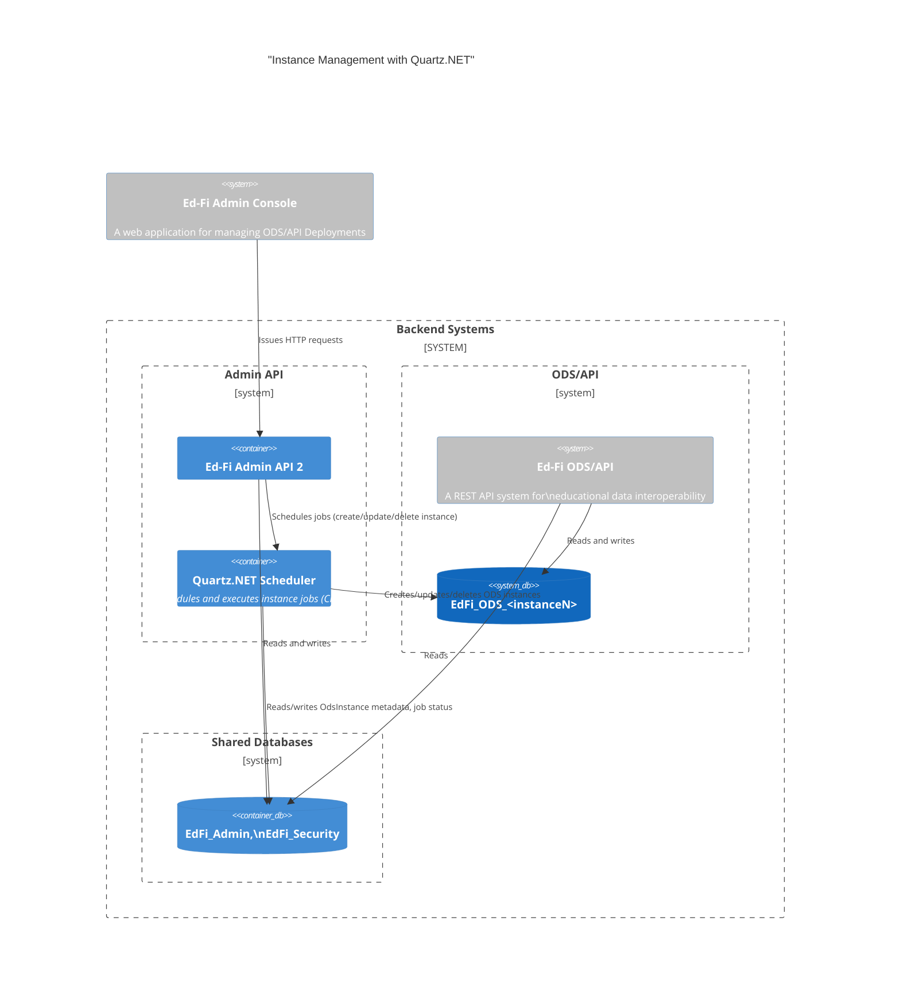

# Instance Management with Quartz.NET

## Overview

Instance CRUD operations (Create, Update, Delete) will be managed using
Quartz.NET as a job scheduler and queue. Admin API endpoints will trigger these
operations, which will be executed asynchronously by Quartz jobs. The
`adminapi.Instances` table will be updated with operation details and status.

## Architecture Diagram



## Flow

1. **API Trigger:**  
    Admin API endpoint receives a request to create, update, or delete an
    instance.

2. **Job Scheduling:**  
    The API schedules a Quartz job (CreateInstanceJob, UpdateInstanceJob,
    DeleteInstanceJob) with the required parameters, including OdsInstance
    metadata and OdsInstanceId.

3. **Job Persistence:**  
    Quartz.NET persists job and trigger data in the database. Job status and
    metadata are tracked in the same database, associated with the
    OdsInstanceId.

4. **Job Execution:**  
    Quartz.NET picks up the job and executes the operation. The job reads/writes
    OdsInstance metadata and updates job status in the database.

5. **Status Update:**  
    The job updates the `adminapi.Instances` table and/or a dedicated job status
    table with the operation status (e.g., "Pending","Completed","InProgress",
    "Pending_Delete", "Deleted", "Delete_Failed", "Error"), linked to the
    OdsInstanceId.

## Quartz.NET Integration

* Quartz jobs are defined for each operation type (Create, Update, Delete).
* Jobs are enqueued by the API, not executed immediately in the request thread.
* Quartz.NET is configured to use a persistent job store. So all job
  and trigger data, as well as job status, are stored in the database.
* Each job receives OdsInstance metadata and OdsInstanceId as parameters.
* Job status and results are persisted in the database, either in the
  `adminapi.Instances` table or a dedicated job status table, always linked to
  the OdsInstanceId.

## Sample Implementation

### 1. Define the Job

```csharp
public class CreateInstanceJob : IJob
{
    public async Task Execute(IJobExecutionContext context)
    {
        var instanceId = context.MergedJobDataMap.GetString("InstanceId");
        var odsInstanceMetadata = context.MergedJobDataMap.GetString("OdsInstanceMetadata");
        // Set job status to InProgress in DB (linked to instanceId)
        // ... perform create logic using odsInstanceMetadata ...
        // On success: set job status to "Completed", update the Instances table, and create the related record in dbo.OdsInstances
        // On failure: update job status and Instances table to Error, with error details
    }
}
```

### 2. Schedule the Job from API

```csharp
public async Task<IActionResult> CreateInstance([FromBody] InstanceModel model)
{
    // Save initial instance record with status "Pending"
    // ...

    var job = JobBuilder.Create<CreateInstanceJob>()
        .WithIdentity($"CreateInstanceJob-{model.Id}")
        .UsingJobData("InstanceId", model.Id)
        .UsingJobData("OdsInstanceMetadata", JsonConvert.SerializeObject(model))
        .Build();

    var trigger = TriggerBuilder.Create()
        .StartNow()
        .Build();

    await _scheduler.ScheduleJob(job, trigger);

    return Accepted();
}
```

### 3. Update Status in Job

* On job start: set job status to "InProgress" in the database, linked to OdsInstanceId
* On success: set job status and Instances table to "Completed"
* On failure: set job status and Instances table to "Error" (with error details)

### 4. Job Maintenance

* Quartz.NET manages job execution, retries, and persistence in the database.
* Failed jobs can be retried or logged for manual intervention.

### 5: Concurrency

Quartz.NET manages job queuing and execution, allowing multiple jobs to be
scheduled and processed in parallel or sequentially, depending on configuration.
However, business-level conflicts (such as renaming and deleting the same
instance at the same time) are not automatically prevented by Quartz.NET.

**Concurrency Considerations:**

* If conflicting jobs (e.g., rename and delete for the same instance) are
  scheduled simultaneously, both could run in parallel unless additional
  safeguards are implemented.
* This can lead to race conditions or inconsistent state (e.g., renaming an
  instance that is being deleted).

**Recommended Practices:**

* Use Quartz.NET’s `[DisallowConcurrentExecution]` attribute on job classes to
  prevent multiple executions of the same job type concurrently.
* Implement logic in your job scheduling or execution layer to ensure only one
  job per instance (by OdsInstanceId) runs at a time. For example, use a
  database lock or status flag to block conflicting operations.
* Before starting a job, check the instance status in the database and only
  proceed if no other conflicting job is in progress.
* Optionally, use a job listener or middleware to enforce these rules.

**Summary:**

Quartz.NET handles the technical aspects of job queuing and execution, but you
must design your jobs and data model to prevent business-level conflicts on the
same instance. Proper safeguards will ensure data integrity and consistent
instance state.

## Benefits

* Decouples API responsiveness from long-running operations.
* Centralized job management and monitoring.
* Scalable and reliable execution of instance operations.
* All job and status data is persisted in the database, supporting robust
  tracking and recovery.
