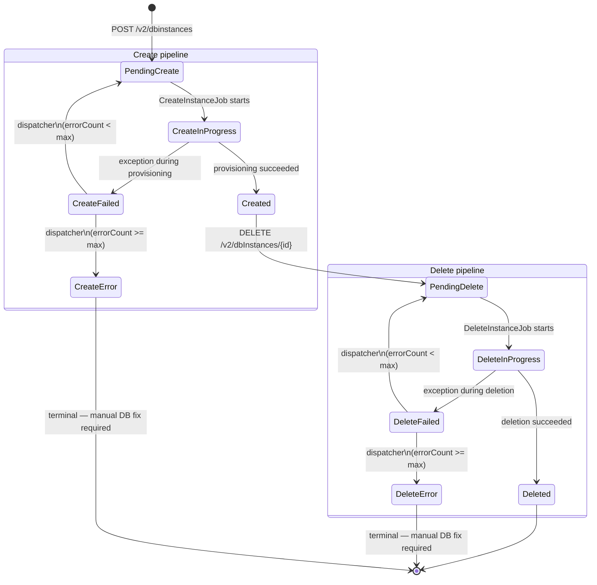
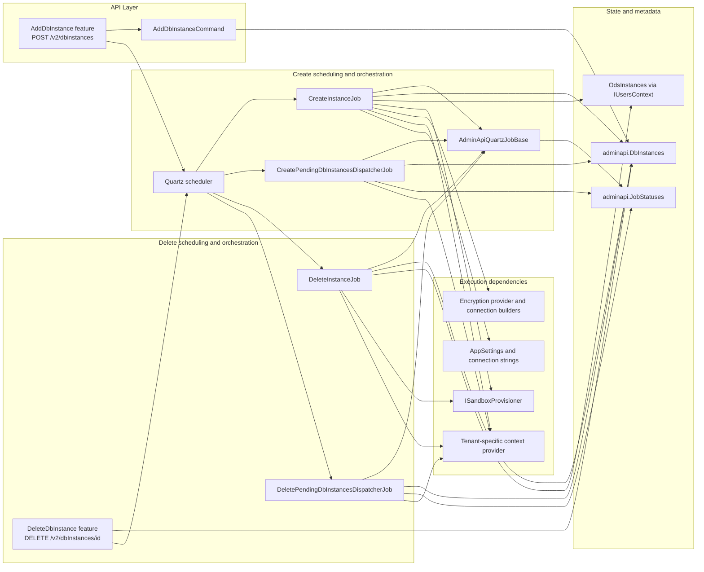
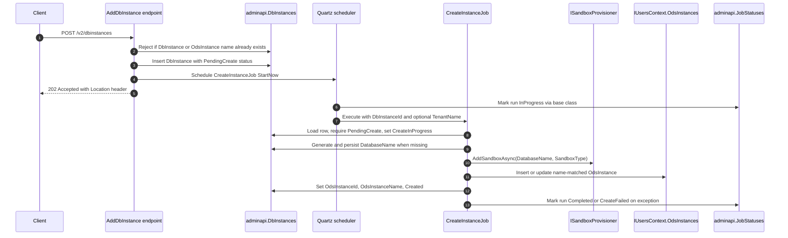
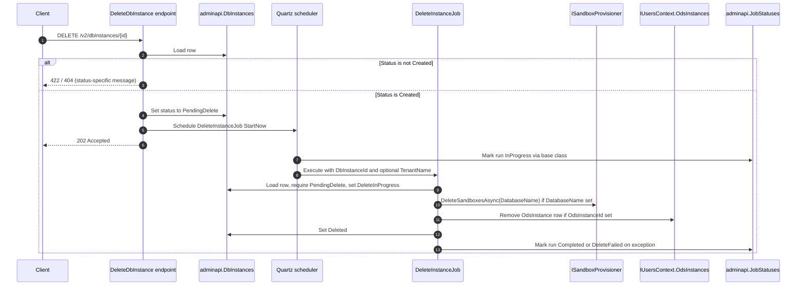
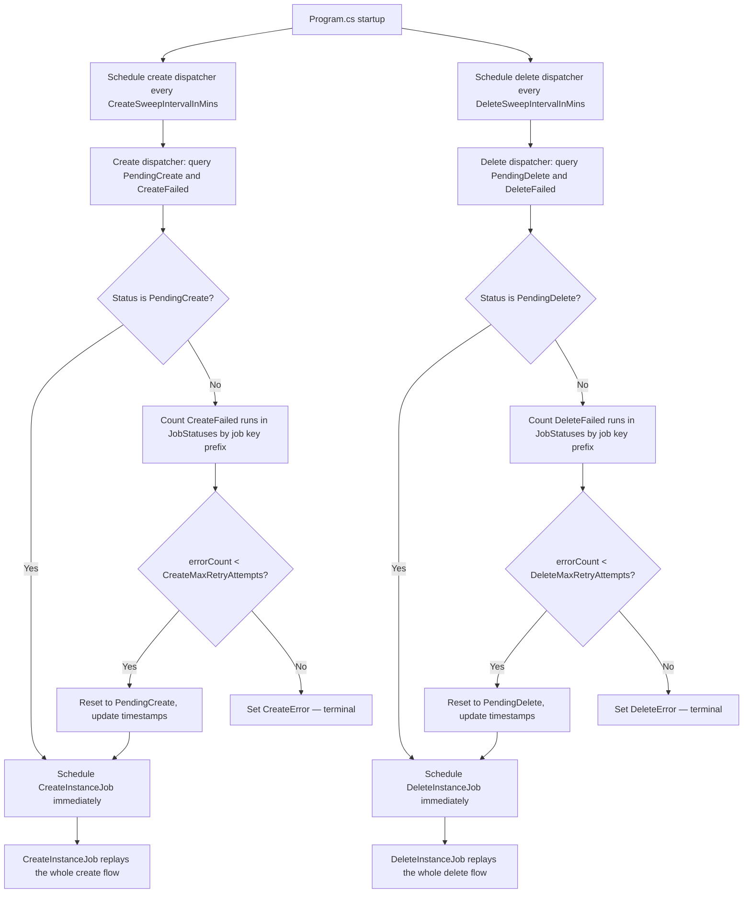
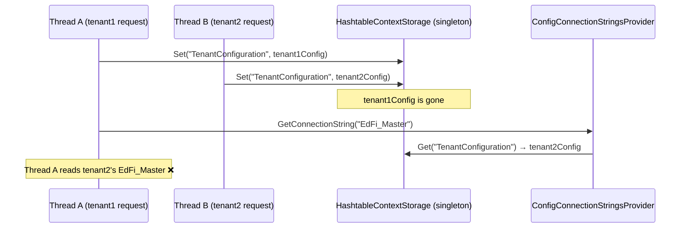
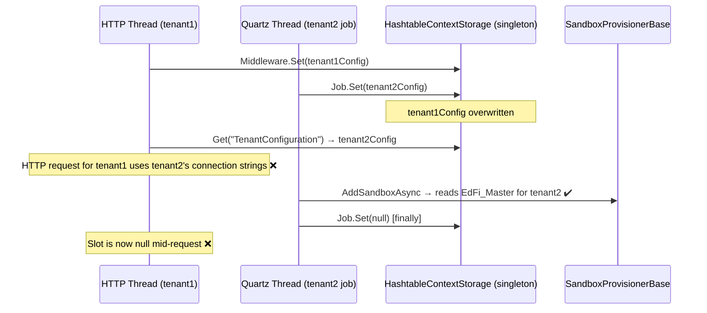

# DbInstance Provisioning Jobs (Quartz.NET)

This document is the durable design reference for the `POST /v2/dbinstances` and `DELETE /v2/dbInstances/{id}` background provisioning pipelines introduced by `ADMINAPI-1369`.

It documents the implemented architecture, runtime flow, configuration, prerequisites, and the technical decisions behind `CreateInstanceJob`, `CreatePendingDbInstancesDispatcherJob`, `DeleteInstanceJob`, and `DeletePendingDbInstancesDispatcherJob`.

## Scope

In scope:

* `POST /v2/dbinstances`
* `DELETE /v2/dbInstances/{id}`
* `CreateInstanceJob`
* `CreatePendingDbInstancesDispatcherJob`
* `DeleteInstanceJob`
* `DeletePendingDbInstancesDispatcherJob`
* `adminapi.DbInstances` lifecycle transitions
* `adminapi.JobStatuses` tracking through the shared Quartz base
* `OdsInstances` synchronization and reconciliation
* Multi-tenant job identity and tenant-aware execution

Out of scope:

* Quartz persistent job store migration
* Broader `OdsInstance` validator redesign outside this workflow

---

## Status Model

Instance management uses a fully explicit status enum. Each value encodes both the pipeline it belongs to and the phase, making rows self-describing when inspected directly in the database.

### Status values

| Status | Pipeline | Phase |
| --- | --- | --- |
| `PendingCreate` | Create | Eligible for worker execution |
| `CreateInProgress` | Create | Currently being provisioned |
| `Created` | Create | Provisioning succeeded |
| `CreateFailed` | Create | Last worker attempt failed — retryable |
| `CreateError` | Create | Max retries exhausted — terminal, manual fix required |
| `PendingDelete` | Delete | Eligible for delete worker execution |
| `DeleteInProgress` | Delete | Currently being deleted |
| `Deleted` | Delete | Deletion succeeded |
| `DeleteFailed` | Delete | Last delete attempt failed — retryable |
| `DeleteError` | Delete | Max delete retries exhausted — terminal, manual fix required |

### Why the old neutral names were replaced

The original values (`Pending`, `InProgress`, `Completed`, `Error`) were pipeline-neutral names that worked when only the create pipeline existed. Once a delete pipeline was added with its own retryable-vs-terminal distinction, neutral names became ambiguous: an `Error` row could belong to either pipeline and required external context to interpret correctly. The redesign replaces them with self-describing names that encode both the pipeline (`Create`/`Delete`) and the phase.

### Why `*Failed` vs `*Error`

The retry system needs to distinguish two fundamentally different states:

* `*Failed` — retryable: the background dispatcher promotes the record back to `Pending*` automatically on the next sweep.
* `*Error` — terminal: max retries have been exhausted and the record requires manual database-level intervention to recover. The dispatcher will no longer process it.

A single `Error` value would require a secondary mechanism — such as an error-count column or a policy lookup — to determine which state the record was in. Splitting the value makes the state explicit and self-describing when a row is inspected directly in the database.

### Why only `Created` instances are deletable via the endpoint

`DELETE /v2/dbInstances/{id}` only accepts requests for rows in `Created` status. Every other non-deleted status has a specific blocking reason:

| Status | HTTP response | Reason blocked |
| --- | --- | --- |
| `PendingCreate` | 400 | Create is pending; deleting now would race with the create job and leave the database and `OdsInstance` row in an unknown state. |
| `CreateInProgress` | 400 | Create is actively executing; same race risk as `PendingCreate`. |
| `CreateFailed` | 400 | Create did not fully succeed; the database may be partially provisioned. Safe deletion requires a human to inspect what actually exists on the server. |
| `CreateError` | 400 | Max create retries exhausted; same partial-provisioning risk as `CreateFailed`. |
| `PendingDelete` | 400 | Already queued for deletion; a second request would duplicate work. |
| `DeleteInProgress` | 400 | Deletion is actively executing; a concurrent second delete would conflict. |
| `DeleteFailed` | 400 | Previous delete attempt failed; the dispatcher handles retry automatically — re-triggering from the endpoint would duplicate the retry. |
| `DeleteError` | 400 | Max delete retries exhausted; requires manual intervention, not an API retry. |
| `Deleted` | 404 | Treated as not found — existing behaviour. |

This constraint makes the API the single safe, human-initiated entry point to the delete pipeline and keeps all retry logic inside the dispatcher where it can be governed and audited.

### Full lifecycle diagram


```mermaid
stateDiagram-v2
    direction TB
    [*] --> PendingCreate : POST /v2/dbinstances

    state "Create pipeline" as Create {
        PendingCreate --> CreateInProgress : CreateInstanceJob starts
        CreateInProgress --> Created : provisioning succeeded
        CreateInProgress --> CreateFailed : exception during provisioning
        CreateFailed --> PendingCreate : dispatcher\n(errorCount < max)
        CreateFailed --> CreateError : dispatcher\n(errorCount >= max)
    }

    state "Delete pipeline" as Delete {
        PendingDelete --> DeleteInProgress : DeleteInstanceJob starts
        DeleteInProgress --> Deleted : deletion succeeded
        DeleteInProgress --> DeleteFailed : exception during deletion
        DeleteFailed --> PendingDelete : dispatcher\n(errorCount < max)
        DeleteFailed --> DeleteError : dispatcher\n(errorCount >= max)
    }

    Created --> PendingDelete : DELETE /v2/dbInstances/{id}
    Deleted --> [*]
    CreateError --> [*] : terminal — manual DB fix required
    DeleteError --> [*] : terminal — manual DB fix required
```

### Execution semantics

**Create pipeline:**

* The endpoint inserts the initial row as `PendingCreate`.
* `CreateInstanceJob` flips `PendingCreate → CreateInProgress → Created` on success.
* `CreateInstanceJob` sets `CreateFailed` when execution throws.
* `CreatePendingDbInstancesDispatcherJob` promotes `CreateFailed` back to `PendingCreate` when `errorCount < max`, or sets `CreateError` (terminal) when the limit is reached.

**Delete pipeline:**

* The endpoint sets the row to `PendingDelete` (only from `Created`) and schedules `DeleteInstanceJob`.
* `DeleteInstanceJob` flips `PendingDelete → DeleteInProgress → Deleted` on success.
* `DeleteInstanceJob` sets `DeleteFailed` when execution throws.
* `DeletePendingDbInstancesDispatcherJob` promotes `DeleteFailed` back to `PendingDelete` when `errorCount < max`, or sets `DeleteError` (terminal) when the limit is reached.

---

## Top-level hierarchy

| Layer | Primary files | Responsibility |
| --- | --- | --- |
| API entry — create | `Application/EdFi.Ods.AdminApi/Features/DbInstances/AddDbInstance.cs` | Validate input, persist the initial `PendingCreate` `DbInstance`, schedule immediate background work, and return `202 Accepted`. |
| API entry — delete | `Application/EdFi.Ods.AdminApi/Features/DbInstances/DeleteDbInstance.cs` | Guard against all non-`Created` statuses, set status to `PendingDelete`, schedule `DeleteInstanceJob`, and return `202 Accepted`. |
| Worker job — create | `Application/EdFi.Ods.AdminApi/Infrastructure/Services/Jobs/CreateInstanceJob.cs` | Process one `DbInstance` from `PendingCreate` to `Created` or `CreateFailed`. |
| Worker job — delete | `Application/EdFi.Ods.AdminApi/Infrastructure/Services/Jobs/DeleteInstanceJob.cs` | Process one `DbInstance` from `PendingDelete` to `Deleted` or `DeleteFailed`. |
| Recovery orchestration — create | `Application/EdFi.Ods.AdminApi/Infrastructure/Services/Jobs/CreatePendingDbInstancesDispatcherJob.cs`, `Application/EdFi.Ods.AdminApi/Program.cs` | Schedule recurring sweeps, discover retryable `PendingCreate`/`CreateFailed` records, and enqueue create worker jobs. |
| Recovery orchestration — delete | `Application/EdFi.Ods.AdminApi/Infrastructure/Services/Jobs/DeletePendingDbInstancesDispatcherJob.cs`, `Application/EdFi.Ods.AdminApi/Program.cs` | Schedule recurring sweeps, discover retryable `PendingDelete`/`DeleteFailed` records, and enqueue delete worker jobs. |
| Shared Quartz infrastructure | `Application/EdFi.Ods.AdminApi.Common/Infrastructure/Jobs/AdminApiQuartzJobBase.cs`, `Application/EdFi.Ods.AdminApi.Common/Infrastructure/Jobs/QuartzJobScheduler.cs`, `Application/EdFi.Ods.AdminApi.Common/Infrastructure/Jobs/JobConstants.cs` | Persist `JobStatuses`, apply common job metadata, and avoid duplicate scheduling for recurring jobs. |
| State and external dependencies | `adminapi.DbInstances`, `adminapi.JobStatuses`, `IUsersContext.OdsInstances`, `ISandboxProvisioner`, connection-string builders, encryption provider | Store business state, track executions, provision databases, and create encrypted `OdsInstance` metadata. |


```mermaid
flowchart LR
    subgraph ApiLayer[API Layer]
        Endpoint[AddDbInstance feature\nPOST /v2/dbinstances]
        Command[AddDbInstanceCommand]
    end

    subgraph Scheduling[Create scheduling and orchestration]
        Scheduler[Quartz scheduler]
        Worker[CreateInstanceJob]
        Dispatcher[CreatePendingDbInstancesDispatcherJob]
        Base[AdminApiQuartzJobBase]
    end

    subgraph Persistence[State and metadata]
        DbInstances[adminapi.DbInstances]
        JobStatuses[adminapi.JobStatuses]
        OdsInstances[OdsInstances via IUsersContext]
    end

    subgraph Dependencies[Execution dependencies]
        Provisioner[ISandboxProvisioner]
        Encryption[Encryption provider and connection builders]
        Tenants[Tenant-specific context provider]
        Config[AppSettings and connection strings]
    end

    Endpoint --> Command --> DbInstances
    Endpoint --> Scheduler
    Scheduler --> Worker
    Scheduler --> Dispatcher
    Worker --> Base --> JobStatuses
    Dispatcher --> Base
    Worker --> DbInstances
    Worker --> OdsInstances
    Worker --> Provisioner
    Worker --> Encryption
    Worker --> Tenants
    Worker --> Config
    Dispatcher --> DbInstances
    Dispatcher --> JobStatuses
    Dispatcher --> Tenants

    subgraph DeleteScheduling[Delete scheduling and orchestration]
        DeleteEndpoint[DeleteDbInstance feature\nDELETE /v2/dbInstances/id]
        DeleteWorker[DeleteInstanceJob]
        DeleteDispatcher[DeletePendingDbInstancesDispatcherJob]
    end

    DeleteEndpoint --> DbInstances
    DeleteEndpoint --> Scheduler
    Scheduler --> DeleteWorker
    Scheduler --> DeleteDispatcher
    DeleteWorker --> Base
    DeleteDispatcher --> Base
    DeleteWorker --> DbInstances
    DeleteWorker --> OdsInstances
    DeleteWorker --> Provisioner
    DeleteWorker --> Tenants
    DeleteDispatcher --> DbInstances
    DeleteDispatcher --> JobStatuses
    DeleteDispatcher --> Tenants
```

---

## Job Triggering Options

Instance management jobs can be triggered in two ways:

### 1. Immediate Trigger

Both `POST /v2/dbinstances` and `DELETE /v2/dbInstances/{id}` schedule their respective worker job with `StartNow`, so provisioning and deletion begin as soon as Quartz picks up the trigger — normally within milliseconds.

### 2. Periodic Scheduled Trigger (dispatcher sweep)

A recurring dispatcher job scans for records that did not complete successfully and re-queues them. This covers two scenarios:

* **Process restart** — if the API process died while a worker was running, the record is left in `CreateInProgress` or `DeleteInProgress`. On the next dispatcher sweep, any stuck records can be manually reset to `PendingCreate` / `PendingDelete` for recovery.
* **Retry after failure** — `CreateFailed` and `DeleteFailed` records are picked up by the dispatcher and re-queued until `*MaxRetryAttempts` is reached, at which point the record is set to `CreateError` or `DeleteError` (terminal).

| Configuration key | Default | Controls |
| --- | --- | --- |
| `AppSettings:CreateDbInstancesSweepIntervalInMins` | 5 | How often the create dispatcher runs |
| `AppSettings:DeleteDbInstancesSweepIntervalInMins` | 5 | How often the delete dispatcher runs |
| `AppSettings:CreateDbInstancesMaxRetryAttempts` | 3 | Max retries for `CreateFailed` before `CreateError` |
| `AppSettings:DeleteDbInstancesMaxRetryAttempts` | 3 | Max retries for `DeleteFailed` before `DeleteError` |

---

## Core model and invariants

* `DbInstance.DatabaseTemplate` maps to both `SandboxType` and `OdsInstance.InstanceType`.
* `DbInstance.DatabaseName` is generated once as `EdFi_Ods_<normalized DbInstance.Name>_<normalized DbInstance.DatabaseTemplate>` and then reused on retries.
* Spaces in both `DbInstance.Name` and `DbInstance.DatabaseTemplate` are normalized to `_` when building `DbInstance.DatabaseName`.
* Duplicate leading `EdFi_Ods` prefix variants are removed from the normalized `DbInstance.Name` segment, case-insensitively, before composing the final database name.
* Prefix de-duplication applies only to the leading `DbInstance.Name` segment, not to later occurrences inside the user-provided name.
* If the normalized `DbInstance.Name` segment collapses to empty because it only contained a prefix variant, the final database name becomes `EdFi_Ods_<normalized DbInstance.DatabaseTemplate>`.
* `AddDbInstance` rejects requests whose generated database name would exceed 63 characters instead of trimming it.
* `AddDbInstance` rejects requests when the trimmed `DbInstance.Name` already exists in `adminapi.DbInstances.Name` for any non-`Deleted` row, or in `admin.OdsInstances.Name`.
* The synchronized final name is always `DbInstance.Name`.
* The final name is written to both `DbInstance.OdsInstanceName` and `OdsInstance.Name`.
* `OdsInstance.ConnectionString` is derived from the configured `EdFi_Ods` connection-string shape and encrypted with `AppSettings:EncryptionKey`.
* `CreateInstanceJob` only processes `PendingCreate` rows.
* `CreatePendingDbInstancesDispatcherJob` only scans rows in `PendingCreate` or `CreateFailed`.
* `DeleteInstanceJob` only processes `PendingDelete` rows.
* `DeletePendingDbInstancesDispatcherJob` only scans rows in `PendingDelete` or `DeleteFailed`.
* `AddDbInstance` validates `DbInstance.Name` so only `A-Za-z0-9 _` characters are accepted before background work is scheduled.

---

## Runtime flow

### Immediate create flow

`POST /v2/dbinstances` is intentionally asynchronous. The endpoint persists the request, schedules `CreateInstanceJob`, and returns immediately.


```mermaid
sequenceDiagram
    autonumber
    participant Client
    participant API as AddDbInstance endpoint
    participant Db as adminapi.DbInstances
    participant Quartz as Quartz scheduler
    participant Worker as CreateInstanceJob
    participant Provisioner as ISandboxProvisioner
    participant Users as IUsersContext.OdsInstances
    participant Status as adminapi.JobStatuses

    Client->>API: POST /v2/dbinstances
    API->>Db: Reject if DbInstance or OdsInstance name already exists
    API->>Db: Insert DbInstance with PendingCreate status
    API->>Quartz: Schedule CreateInstanceJob StartNow
    API-->>Client: 202 Accepted with Location header
    Quartz->>Status: Mark run InProgress via base class
    Quartz->>Worker: Execute with DbInstanceId and optional TenantName
    Worker->>Db: Load row, require PendingCreate, set CreateInProgress
    Worker->>Db: Generate and persist DatabaseName when missing
    Worker->>Provisioner: AddSandboxAsync(DatabaseName, SandboxType)
    Worker->>Users: Insert or update name-matched OdsInstance
    Worker->>Db: Set OdsInstanceId, OdsInstanceName, Created
    Worker->>Status: Mark run Completed or CreateFailed on exception
```

### Immediate delete flow

`DELETE /v2/dbInstances/{id}` blocks any non-`Created` status with a specific 422 message, then schedules `DeleteInstanceJob` and returns immediately.


```mermaid
sequenceDiagram
    autonumber
    participant Client
    participant API as DeleteDbInstance endpoint
    participant Db as adminapi.DbInstances
    participant Quartz as Quartz scheduler
    participant Worker as DeleteInstanceJob
    participant Provisioner as ISandboxProvisioner
    participant Users as IUsersContext.OdsInstances
    participant Status as adminapi.JobStatuses

    Client->>API: DELETE /v2/dbInstances/{id}
    API->>Db: Load row
    alt Status is not Created
        API-->>Client: 422 / 404 (status-specific message)
    else Status is Created
        API->>Db: Set status to PendingDelete
        API->>Quartz: Schedule DeleteInstanceJob StartNow
        API-->>Client: 202 Accepted
        Quartz->>Status: Mark run InProgress via base class
        Quartz->>Worker: Execute with DbInstanceId and optional TenantName
        Worker->>Db: Load row, require PendingDelete, set DeleteInProgress
        Worker->>Provisioner: DeleteSandboxesAsync(DatabaseName) if DatabaseName set
        Worker->>Users: Remove OdsInstance row if OdsInstanceId set
        Worker->>Db: Set Deleted
        Worker->>Status: Mark run Completed or DeleteFailed on exception
    end
```

### Recovery and retry flow

The dispatcher owns recurring discovery and retry gating. The worker stays focused on one row at a time and does not decide by itself when a `*Failed` row is eligible to replay.


```mermaid
flowchart TD
    Startup[Program.cs startup] --> ScheduleCreate[Schedule create dispatcher every CreateSweepIntervalInMins]
    Startup --> ScheduleDelete[Schedule delete dispatcher every DeleteSweepIntervalInMins]

    ScheduleCreate --> CreateSweep[Create dispatcher: query PendingCreate and CreateFailed]
    CreateSweep --> IsPendingCreate{Status is PendingCreate?}
    IsPendingCreate -->|Yes| QueueCreate[Schedule CreateInstanceJob immediately]
    IsPendingCreate -->|No| CreateRetryCheck[Count CreateFailed runs in JobStatuses by job key prefix]
    CreateRetryCheck --> CreateEligible{errorCount < CreateMaxRetryAttempts?}
    CreateEligible -->|Yes| PromoteCreate[Reset to PendingCreate, update timestamps]
    PromoteCreate --> QueueCreate
    CreateEligible -->|No| CreateExhausted[Set CreateError — terminal]
    QueueCreate --> CreateWorkerRun[CreateInstanceJob replays the whole create flow]

    ScheduleDelete --> DeleteSweep[Delete dispatcher: query PendingDelete and DeleteFailed]
    DeleteSweep --> IsPendingDelete{Status is PendingDelete?}
    IsPendingDelete -->|Yes| QueueDelete[Schedule DeleteInstanceJob immediately]
    IsPendingDelete -->|No| DeleteRetryCheck[Count DeleteFailed runs in JobStatuses by job key prefix]
    DeleteRetryCheck --> DeleteEligible{errorCount < DeleteMaxRetryAttempts?}
    DeleteEligible -->|Yes| PromoteDelete[Reset to PendingDelete, update timestamps]
    PromoteDelete --> QueueDelete
    DeleteEligible -->|No| DeleteExhausted[Set DeleteError — terminal]
    QueueDelete --> DeleteWorkerRun[DeleteInstanceJob replays the whole delete flow]
```

---

## Job identity and payloads

### Worker job identity

Both worker jobs use per-record Quartz identities:

| Job | Single-tenant key | Multi-tenant key |
| --- | --- | --- |
| `CreateInstanceJob` | `CreateInstanceJob-{DbInstanceId}` | `CreateInstanceJob-{TenantName}-{DbInstanceId}` |
| `DeleteInstanceJob` | `DeleteInstanceJob-{DbInstanceId}` | `DeleteInstanceJob-{TenantName}-{DbInstanceId}` |

Payload: `DbInstanceId` + `TenantName` (when multi-tenancy is enabled).

### Dispatcher job identity

Recurring dispatchers are scheduled from `Program.cs`:

| Dispatcher | Single-tenant key | Multi-tenant key |
| --- | --- | --- |
| `CreatePendingDbInstancesDispatcherJob` | `CreatePendingDbInstancesDispatcherJob` | `CreatePendingDbInstancesDispatcherJob_{TenantName}` |
| `DeletePendingDbInstancesDispatcherJob` | `DeletePendingDbInstancesDispatcherJob` | `DeletePendingDbInstancesDispatcherJob_{TenantName}` |

Payload: `TenantName` when multi-tenancy is enabled.

### Job status tracking model

All jobs inherit from `AdminApiQuartzJobBase`. The base class:

* derives a job id from `context.JobDetail.Key.Name`
* creates a run id as `{jobId}_{context.FireInstanceId}`
* writes `InProgress`, `Completed`, or `Error` into `adminapi.JobStatuses`

Retry counting is based on persisted `JobStatuses` rows that match the worker job identity prefix for the current `DbInstance`.

---

## Prerequisites

The feature works correctly only when these prerequisites are in place:

* Admin API runs in `v2` mode so startup scheduling in `Program.cs` can register the recurring dispatchers.
* Quartz services are registered and the hosted service is enabled.
* The Admin API database migrations have been applied so `adminapi.DbInstances` and `adminapi.JobStatuses` exist.
* `AppSettings:EncryptionKey` is configured with a valid base64-encoded key because `CreateInstanceJob` encrypts the final `OdsInstance.ConnectionString`.
* `ConnectionStrings:EdFi_Ods` points at the normal ODS server shape used to build per-sandbox connection strings.
* `ConnectionStrings:EdFi_Master` points at the maintenance database used by provisioning. For PostgreSQL this should be the `postgres` database, not an ODS database.
* When multi-tenancy is enabled, the active tenant must have tenant-specific `EdFi_Admin`, `EdFi_Security`, `EdFi_Ods`, and `EdFi_Master` connection strings available before the job runs.

---

## Configuration reference

| Setting | Used by | Why it matters |
| --- | --- | --- |
| `AppSettings:CreateDbInstancesSweepIntervalInMins` | `Program.cs` | Controls how often the create dispatcher sweeps for `PendingCreate` and retryable `CreateFailed` records. |
| `AppSettings:CreateDbInstancesMaxRetryAttempts` | `CreatePendingDbInstancesDispatcherJob` | Caps the number of times a `CreateFailed` record can be requeued before it is set to `CreateError`. |
| `AppSettings:DeleteDbInstancesSweepIntervalInMins` | `Program.cs` | Controls how often the delete dispatcher sweeps for `PendingDelete` and retryable `DeleteFailed` records. |
| `AppSettings:DeleteDbInstancesMaxRetryAttempts` | `DeletePendingDbInstancesDispatcherJob` | Caps the number of times a `DeleteFailed` record can be requeued before it is set to `DeleteError`. |
| `AppSettings:MultiTenancy` | endpoint, worker, dispatcher, startup scheduling | Turns on tenant-aware job keys, `TenantName` payload propagation, and tenant-specific context resolution. |
| `AppSettings:DatabaseEngine` | provisioner and connection-string handling | Must match the database platform used for sandbox provisioning. |
| `AppSettings:EncryptionKey` | `CreateInstanceJob` | Required to encrypt the persisted `OdsInstance.ConnectionString`. |
| `ConnectionStrings:EdFi_Ods` | `CreateInstanceJob` | Provides the connection-string shape used to build the final encrypted ODS connection string in single-tenant mode. |
| `Tenants:{tenant}:ConnectionStrings:EdFi_Ods` | `CreateInstanceJob` | Provides the tenant-specific ODS connection-string shape when multi-tenancy is enabled. |
| `ConnectionStrings:EdFi_Master` | `ISandboxProvisioner` | Provides the maintenance-database connection used during sandbox create and delete operations. |
| `Tenants:{tenant}:ConnectionStrings:EdFi_Master` | `ISandboxProvisioner` via `ConfigConnectionStringsProvider` | Provides the per-tenant maintenance-database connection when multi-tenancy is enabled. Overrides the top-level `ConnectionStrings:EdFi_Master` for that tenant's provisioning job. |

---

## Technical decisions and rationale

### Why both endpoints return 202

`POST /v2/dbinstances` and `DELETE /v2/dbInstances/{id}` both return `202 Accepted` because the actual work — provisioning or dropping a database and synchronizing `OdsInstances` — can take significant time. Blocking the HTTP thread on that work would make latency unpredictable, couple API availability to provisioning latency, and would not survive process restarts during in-flight operations.

### Why the delete endpoint does not accept retry-failed statuses

`DeleteFailed` and `DeleteError` rows are intentionally not actionable from the API. `DeleteFailed` rows are handled automatically by `DeletePendingDbInstancesDispatcherJob` without human intervention. `DeleteError` rows have exceeded max retries and indicate a database-level condition that requires operator investigation — re-triggering via the API endpoint would mask that signal and loop indefinitely. The correct recovery path is to fix the underlying database condition and then reset the row manually to `PendingDelete` in the database.

### Why there are two jobs per pipeline

Each pipeline deliberately uses two jobs:

* The worker job (`CreateInstanceJob` / `DeleteInstanceJob`) owns single-record execution.
* The dispatcher job (`CreatePendingDbInstancesDispatcherJob` / `DeletePendingDbInstancesDispatcherJob`) owns recurring discovery, retry gating, and rescheduling.

This separation keeps each worker small and deterministic. It also avoids teaching the worker how to scan the database, calculate retry eligibility, or coordinate recurring sweeps. The delete pipeline mirrors the create pipeline so both can be reasoned about with the same mental model.

### Why retries replay the whole flow

Retries reuse the same `DbInstance.DatabaseName` and replay the full create path instead of special-casing only one step. That keeps the happy path and the retry path aligned, and it relies on `AddSandboxAsync` being able to recreate the sandbox for the same database name.

### Why character validation happens at the endpoint

The sandbox provisioners only accept database identifiers that contain letters, numbers, and underscores. `AddDbInstance` therefore rejects `DbInstance.Name` values outside `A-Za-z0-9 _` before the worker is scheduled. That keeps invalid characters out of the persisted create flow while still allowing spaces in the request contract and normalizing those spaces to underscores in the worker-generated database name.

### Why the feature rejects long database names

The feature uses a 63-character portable limit for generated database names and rejects requests above that limit instead of trimming them. PostgreSQL may apply identifier-length behavior differently than SQL Server, but the Admin API persists `DbInstance.DatabaseName`, uses it to build the encrypted ODS connection string, and uses the same value for provisioning and status checks. Rejecting oversized names keeps the persisted value aligned with the actual provisioned database across supported engines and avoids silent truncation collisions.

### Why retry count comes from `JobStatuses`

Retry counts are derived from persisted `adminapi.JobStatuses` rows by worker-job key prefix instead of adding dedicated retry columns to `DbInstance`. That keeps retry accounting inside the existing Quartz execution trail and avoids additional schema changes for this feature.

### Reconciliation strategy

The main retry risk is partial success across `OdsInstance` and `DbInstance` persistence:

* `OdsInstance` insert succeeds
* `DbInstance` update fails
* a later retry reaches the same final-name `OdsInstance`

The implemented behavior handles this by looking up an existing `OdsInstance` by final synchronized name and reusing that row during replay. That keeps retry behavior whole-flow and avoids duplicate final-name rows.

### Multi-tenancy strategy

Multi-tenancy is a job payload concern as well as a configuration concern:

* scheduled jobs must carry `TenantName`
* tenant identity becomes part of the Quartz job key
* worker and dispatcher resolve tenant-specific contexts before reading or writing state
* tenant-specific `EdFi_Ods` connection-string shape is used when building the encrypted `OdsInstance.ConnectionString`

#### How the job sets tenant context

HTTP requests have `TenantResolverMiddleware` running automatically for every request, which calls `IContextProvider<TenantConfiguration>.Set(tenantConfig)` so downstream services always see the right tenant.

Quartz jobs run **outside the HTTP pipeline** — no middleware runs. `CreateInstanceJob` and `DeleteInstanceJob` therefore mimic the middleware by calling `Set(tenantConfiguration)` explicitly at the start of execution and `Set(null)` in the `finally` block. This is what allows `ConfigConnectionStringsProvider` and `SandboxProvisionerBase` to resolve the correct per-tenant `EdFi_Master` and `EdFi_Ods` connection strings during provisioning.

```
HTTP request path:
  TenantResolverMiddleware.Set(tenantConfig) → Controller → Provisioner reads EdFi_Master ✓

Quartz job path (no middleware):
  CreateInstanceJob.Set(tenantConfig) → Provisioner reads EdFi_Master ✓
  CreateInstanceJob.Set(null) [in finally]
```

#### How connection strings are resolved

`ConfigConnectionStringsProvider` builds the connection string map dynamically on every call (registered as `Transient`). In multi-tenant mode it reads the current ambient `TenantConfiguration` from `IContextProvider<TenantConfiguration>` and overlays per-tenant values on top of the base `ConnectionStrings` config section:

| Priority | Source | Applies when |
| --- | --- | --- |
| 1 (highest) | `Tenants:{tenant}:ConnectionStrings:*` via `TenantConfiguration` | Multi-tenancy enabled and tenant context is set |
| 2 (fallback) | Top-level `ConnectionStrings:*` in config / environment | Always present as base |

#### Known limitation: ambient context isolation

The current `IContextStorage` implementation (`HashtableContextStorage`) is a singleton backed by a plain `Hashtable` — one slot per type, shared across all threads. This means concurrent operations (two HTTP requests for different tenants, or a job and an HTTP request running simultaneously) can overwrite each other's context slot, causing a service to read the wrong tenant's connection strings.

This is a **pre-existing** architectural limitation. The provisioning job makes it materially worse for two reasons:

* **A new, non-HTTP writer exists.** Quartz threads call `Set()` and `Set(null)` from outside the HTTP pipeline. A job running during an in-flight HTTP request can overwrite the slot mid-request and then null it out in the `finally` block, leaving the HTTP request with no tenant context for the remainder of its execution.
* **The race window is much longer.** Provisioning jobs run for seconds to minutes. During that entire span the shared slot is held by the job, making collisions with concurrent HTTP requests far more likely.

See the [Context isolation risk and remediation options](#context-isolation-risk-and-remediation-options) section for the full analysis and remediation plans.

### Restart recovery strategy

Restart recovery depends on the recurring dispatcher, not on a persistent Quartz job store. If the process restarts, the next sweep reconstructs work from `DbInstances` state and the persisted `JobStatuses` history.

---

## Sample Implementation

### Define a worker job

```csharp
[DisallowConcurrentExecution]
public class CreateInstanceJob : AdminApiQuartzJobBase, IJob
{
    public override async Task ExecuteJob(IJobExecutionContext context)
    {
        var dbInstanceId = context.MergedJobDataMap.GetInt("DbInstanceId");
        // Guard: skip if not PendingCreate (race condition protection)
        // Set status to CreateInProgress
        // ... provision database, insert/update OdsInstance ...
        // On success: set status to Created
        // On exception: set status to CreateFailed, rethrow
    }
}
```

### Schedule a job from the endpoint

```csharp
var job = JobBuilder.Create<CreateInstanceJob>()
    .WithIdentity($"CreateInstanceJob-{id}")
    .UsingJobData("DbInstanceId", id)
    .Build();

var trigger = TriggerBuilder.Create().StartNow().Build();
await scheduler.ScheduleJob(job, trigger);
return Results.Accepted($"/dbinstances/{id}", null);
```

### Dispatcher skeleton

```csharp
[DisallowConcurrentExecution]
public class CreatePendingDbInstancesDispatcherJob : AdminApiQuartzJobBase, IJob
{
    public override async Task ExecuteJob(IJobExecutionContext context)
    {
        var pending = await dbContext.DbInstances
            .Where(x => x.Status == DbInstanceStatus.PendingCreate.ToString()
                     || x.Status == DbInstanceStatus.CreateFailed.ToString())
            .ToListAsync();

        foreach (var instance in pending)
        {
            if (instance.Status == DbInstanceStatus.PendingCreate.ToString())
            {
                // Schedule CreateInstanceJob immediately
            }
            else // CreateFailed
            {
                var errorCount = /* count from JobStatuses */;
                if (errorCount < settings.CreateDbInstancesMaxRetryAttempts)
                {
                    instance.Status = DbInstanceStatus.PendingCreate.ToString();
                    // Schedule CreateInstanceJob
                }
                else
                {
                    instance.Status = DbInstanceStatus.CreateError.ToString(); // terminal
                }
                await dbContext.SaveChangesAsync();
            }
        }
    }
}
```

---

## Validation and verification coverage

Current implementation coverage is centered in:

**Create pipeline:**

* `Application/EdFi.Ods.AdminApi.UnitTests/Features/DbInstances/AddDbInstanceTests.cs`
* `Application/EdFi.Ods.AdminApi.UnitTests/Infrastructure/Services/Jobs/CreateInstanceJobTests.cs`
* `Application/EdFi.Ods.AdminApi.UnitTests/Infrastructure/Services/Jobs/CreatePendingDbInstancesDispatcherJobTests.cs`

**Delete pipeline:**

* `Application/EdFi.Ods.AdminApi.UnitTests/Features/DbInstances/DeleteDbInstanceTests.cs`

The expected behaviors covered by tests and manual verification include:

* immediate endpoint scheduling (create and delete)
* tenant-aware job identity creation
* single-record execution from `PendingCreate` and `PendingDelete`
* transition to `CreateFailed` / `DeleteFailed` on exceptions
* recurring dispatcher pickup of `PendingCreate` / `PendingDelete` rows
* capped retries for `CreateFailed` / `DeleteFailed` rows, with terminal `CreateError` / `DeleteError` on exhaustion
* endpoint blocking guard for all non-`Created` statuses before delete
* reconciliation by reusing an existing final-name `OdsInstance` on create retry

---

## Context isolation risk and remediation options

### Discovery

This issue was discovered while investigating a CI failure where `CreateInstanceJob` provisioned a `DbInstance` to `CreateFailed` status in the multi-tenant PostgreSQL Docker pipeline. The root cause traced through three layers:

1. **Docker compose** — the multi-tenant compose file did not set `ConnectionStrings__EdFi_Master` or `ConnectionStrings__EdFi_Ods`, so the fallback values from `appsettings.json` pointed to `localhost`, which is unreachable from inside the container.
2. **ConfigConnectionStringsProvider** — it was registered as a singleton and read the config section once at startup, so even with correct env vars it could not pick up per-tenant connection strings at runtime.
3. **HashtableContextStorage** — deeper analysis of how the tenant context is stored revealed a shared-state concurrency problem that affects both HTTP and job paths in multi-tenant deployments.

Items 1 and 2 were fixed as part of the CI investigation (Docker compose updated, `ConfigConnectionStringsProvider` made transient and dynamic, `CreateInstanceJob` now sets tenant context explicitly). Item 3 was resolved by replacing `HashtableContextStorage` with `AsyncLocalContextStorage` — see [Chosen remediation: AsyncLocal storage](#chosen-remediation-asynclocal-storage) below.

### How `HashtableContextStorage` works today

`IContextProvider<TenantConfiguration>` is the mechanism both `TenantResolverMiddleware` (HTTP) and `CreateInstanceJob` (Quartz) use to communicate the active tenant to downstream services. Its backing store is `HashtableContextStorage`:

```csharp
// Registered as Singleton — one instance for the lifetime of the application
public class HashtableContextStorage : IContextStorage
{
    public Hashtable UnderlyingHashtable { get; } = [];      // shared by ALL threads

    public void SetValue(string key, object value) => UnderlyingHashtable[key] = value;
    public T? GetValue<T>(string key) => (T?) UnderlyingHashtable[key];
}
```

The key is `typeof(TenantConfiguration).FullName` — a single string constant. Every call to `Set()` from any thread overwrites the same slot for every other thread.

### Race condition: two concurrent HTTP requests


```mermaid
sequenceDiagram
    participant T1 as Thread A (tenant1 request)
    participant T2 as Thread B (tenant2 request)
    participant Store as HashtableContextStorage (singleton)
    participant CSP as ConfigConnectionStringsProvider

    T1->>Store: Set("TenantConfiguration", tenant1Config)
    T2->>Store: Set("TenantConfiguration", tenant2Config)
    Note over Store: tenant1Config is gone
    T1->>CSP: GetConnectionString("EdFi_Master")
    CSP->>Store: Get("TenantConfiguration") → tenant2Config
    Note over T1: Thread A reads tenant2's EdFi_Master ❌
```

### Race condition: Quartz job overlapping with HTTP request


```mermaid
sequenceDiagram
    participant HTTP as HTTP Thread (tenant1)
    participant JOB as Quartz Thread (tenant2 job)
    participant Store as HashtableContextStorage (singleton)
    participant Prov as SandboxProvisionerBase

    HTTP->>Store: Middleware.Set(tenant1Config)
    JOB->>Store: Job.Set(tenant2Config)
    Note over Store: tenant1Config overwritten
    HTTP->>Store: Get("TenantConfiguration") → tenant2Config
    Note over HTTP: HTTP request for tenant1 uses tenant2's connection strings ❌
    JOB->>Prov: AddSandboxAsync → reads EdFi_Master for tenant2 ✔️
    JOB->>Store: Job.Set(null) [finally]
    Note over HTTP: Slot is now null mid-request ❌
```

### Why this matters

* **Silent data corruption**: no exception is thrown. The provisioner connects to the wrong host and creates a database on the wrong tenant's server. The `OdsInstance.ConnectionString` encrypted at the end of the job points to the wrong database.
* **Non-deterministic**: the race depends on timing. It does not reproduce on every run, which makes debugging difficult.
* **Invisible in tests**: unit tests mock `IContextProvider<TenantConfiguration>` and never exercise the singleton `HashtableContextStorage`.

### Chosen remediation: AsyncLocal storage

**Decision**: replace `HashtableContextStorage` with `AsyncLocalContextStorage`.

`AsyncLocal<T>` is isolated per async execution context. Each HTTP request and each Quartz task has its own logical call chain, so reads and writes are invisible to other chains. This fixes all races — both concurrent HTTP requests and overlapping job/HTTP execution — with a single-class change and no interface modifications.

```csharp
public class AsyncLocalContextStorage : IContextStorage
{
    private static readonly AsyncLocal<Dictionary<string, object?>> _storage = new();

    private static Dictionary<string, object?> Current =>
        _storage.Value ??= new Dictionary<string, object?>();

    public void SetValue(string key, object value) => Current[key] = value;
    public T? GetValue<T>(string key) => Current.TryGetValue(key, out var v) ? (T?) v : default;
}
```

Registration change: `AddSingleton<IContextStorage, AsyncLocalContextStorage>` (the singleton lifetime is correct because `AsyncLocal<T>` manages per-execution-context isolation internally).

**Why this option was chosen over the alternatives:**

* It is the smallest code change (1 class, 1 DI registration).
* [`AsyncLocal<T>`](https://learn.microsoft.com/en-us/dotnet/api/system.threading.asynclocal-1) is the idiomatic .NET mechanism for ambient async context — used internally by ASP.NET Core's own `IHttpContextAccessor`.
* It fixes both race surfaces simultaneously: concurrent HTTP requests and overlapping job/HTTP execution.
* No interface changes, no test changes (unit tests mock `IContextProvider<TenantConfiguration>` directly and do not exercise the storage layer).
* The `[DisallowConcurrentExecution]` attribute already on both worker jobs remains a complementary safeguard at the job-scheduling level.

---

## Pending work and known limitations

### E2E test: `DELETE - DbInstance - Success` is skipped in CI

**Status**: skipped (`skip: true` in `meta` block)

**File**: `Application/EdFi.Ods.AdminApi/E2E Tests/V2/Bruno Admin API E2E 2.0 refactor/v2/DbInstances/DELETE - DbInstance - Success.bru`

**Root cause**: The test's pre-request script creates a `DbInstance` using the `Minimal` database template and polls until provisioning completes. In the CI pipeline, neither the `Minimal` template database (`EdFi_Ods_Minimal_Template`) nor the `Sample` template database (`EdFi_Ods_Populated_Template`) is seeded into the target PostgreSQL instance before the test suite runs. The provisioner finds no source database to copy and transitions the `DbInstance` to `CreateFailed` status, causing the pre-request assertion to fail before the DELETE request is even issued.

**Resolution required**: Seed the Minimal and/or Sample template databases in the CI Docker environment before running the E2E suite, then remove `skip: true` from the affected test file.

### `HashtableContextStorage` concurrency (ambient context isolation)

**Status**: resolved — `AsyncLocalContextStorage` implemented

See [Context isolation risk and remediation options](#context-isolation-risk-and-remediation-options) above for the full analysis.
