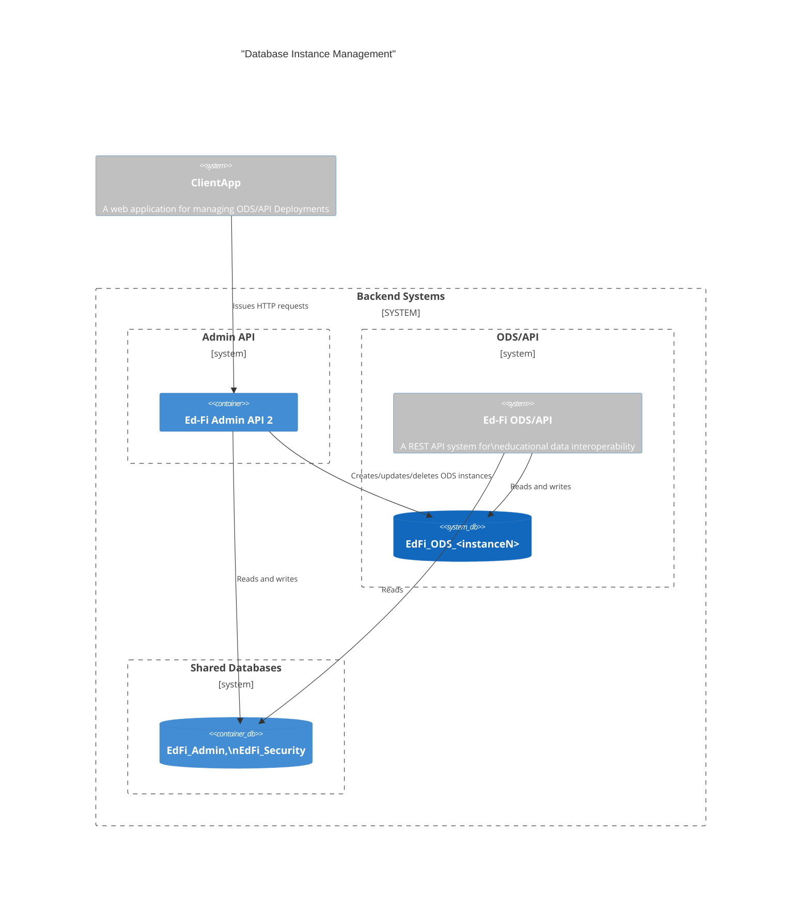
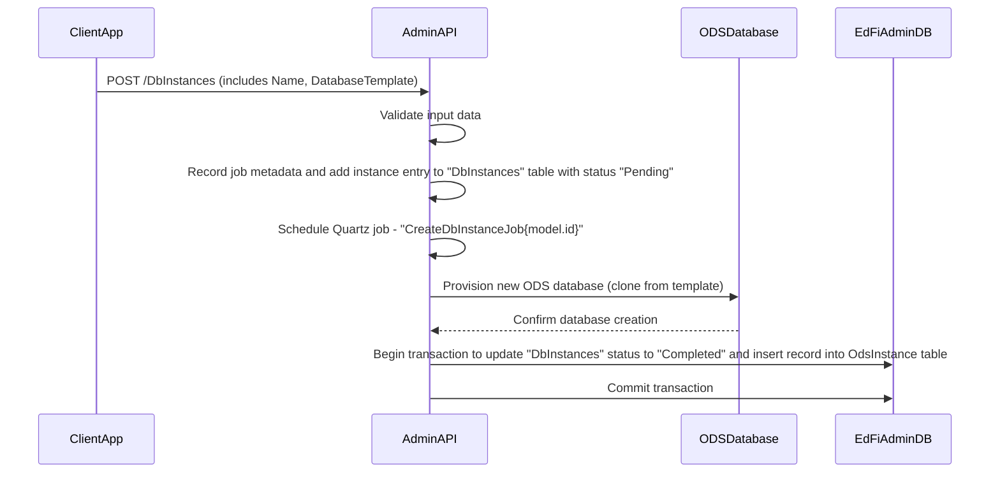

# Ed-Fi ODS Instance Management Design

This document describes the design and workflow for managing Ed-Fi ODS database
instances using the Admin API. All orchestration, job scheduling, and status
updates are handled by the Admin API, leveraging Quartz.NET for asynchronous
operations.

## API Endpoints Overview

Database instance management operations are performed on the `adminapi.DbInstances`
endpoint for direct database management (create, rename, delete).

## System Architecture



## Functional Requirements and Status Values

### adminapi.DbInstances Endpoint Operations

The `adminapi.DbInstances` endpoint supports the following operations:

1. **Create Database Instance**: Provision a new ODS database instance. This operation creates a new record in `adminapi.DbInstances` and provisions the database using the specified template (minimal or sample).
2. **Delete Database Instance**: Remove an existing database instance. This is a soft delete; the `Status` field in `adminapi.DbInstances` is set to "DELETED" for audit purposes, and the database is dropped.
3. **Read all the database Instances**: Read instance details (OdsInstanceId, OdsInstanceName, Status, DatabaseTemplate).
4. **Read database Instance by Id**: Read Instance details by OdsInstance id.

All operations update the `Status` field in `adminapi.DbInstances` to reflect the current state (e.g., "Pending", "Completed", "InProgress", "Pending_Delete", "Deleted", "Delete_Failed", "Error").

```sql
CREATE TABLE [adminapi].[DbInstances] (
    [Id] INT IDENTITY(1,1) NOT NULL,
    [OdsInstanceId] INT NOT NULL,
    [OdsInstanceName] NVARCHAR(100) NOT NULL, 
    [Status] NVARCHAR(75) NOT NULL,
    [DatabaseTemplate] NVARCHAR(100) NOT NULL,
    [DatabaseName] NVARCHAR(255) NULL,
    [LastRefreshed] DATETIME2 NOT NULL DEFAULT GETUTCDATE(),
    [LastModifiedDate] DATETIME2 NULL,
    CONSTRAINT [PK_DbInstances] PRIMARY KEY ([Id])
)
```

## Instance Management Workflow

All instance management operations are now orchestrated by the Admin API. The Admin API schedules and executes database instance creation, and deletion jobs via the `adminapi.DbInstances` endpoint (using a job scheduler such as Quartz.NET), updates the status in the `adminapi.DbInstances` table, and manages all related metadata. Successfully created database instance details will be creating a new record on dbo.OdsInstances table with connection string.

> [!TIP]
> The processes below refer to the single `adminapi.DbInstances` table managed by Admin API 2.
> Admin API 2 on startup queries the `dbo.OdsInstances` table used by the ODS/API
> and inserts missing records into the new table. This solves a potential
> synchronization problem between these two tables.

#### Create Database Instance



#### Delete Database Instance


## Cloud Support (Planned)

> [!NOTE]
> Placeholder. The `adminapi.DbInstances` endpoint will support cloud database providers in future releases. The database creation process may differ across managed database solutions.
