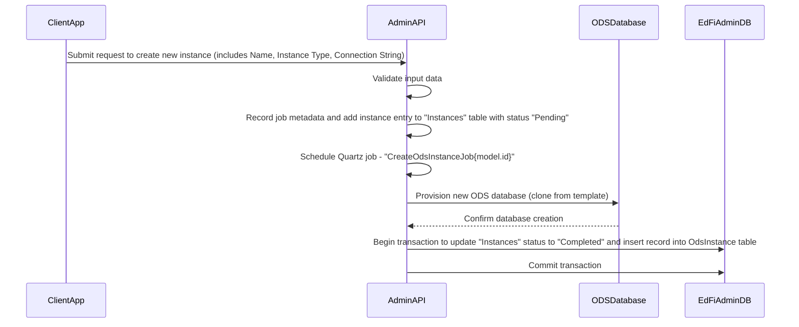
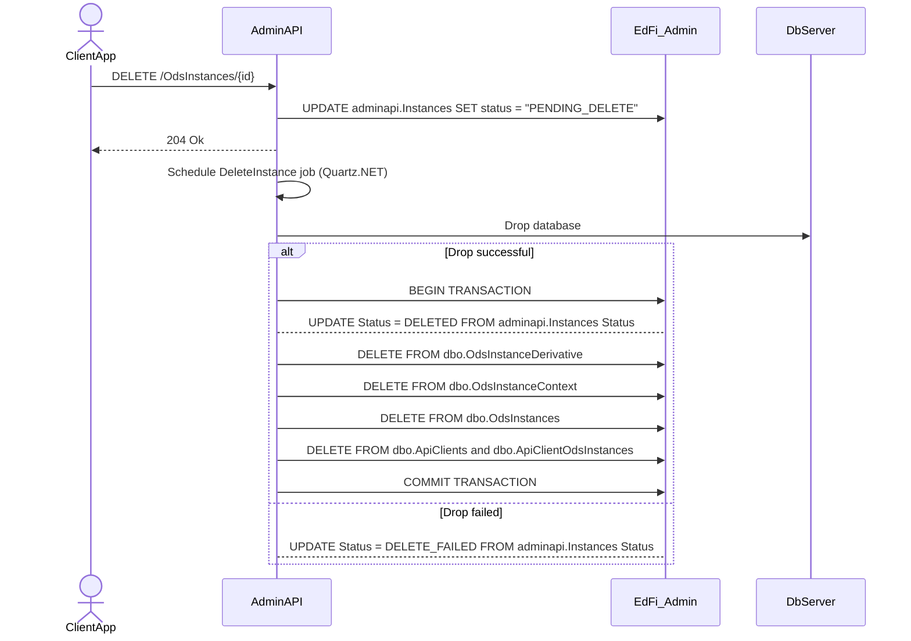
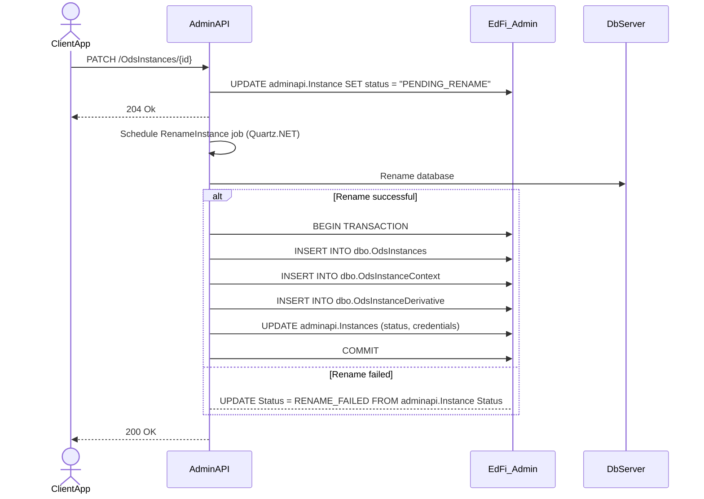

# Ed-Fi ODS Instance Management Design

This document describes the design and workflow for managing Ed-Fi ODS database instances using the Admin API. All orchestration, job scheduling, and status updates are handled by the Admin API, leveraging Quartz.NET for asynchronous operations.

## System Architecture


## Functional Requirements and Status Values

Users will need the ability to perform the following operations for ODS database
instances:

1. Create a new instance and insert records into the `dbo.OdsInstances` and related tables.
2. Rename an existing instance in `dbo.OdsInstances`.
3. Delete an existing instance and delete records from `dbo.OdsInstances`.

The first three operations will also require updating the `Status` field in the
`adminapi.Instances` table. From this perspective, the delete operation will
be a _soft delete_ for audit purposes. That is, the
`adminapi.Instances.Status` field will be set to "DELETED" instead of
physically deleting the row.

> [!NOTE]
> Valid Instances.Status values - "Pending","Completed","InProgress", "Pending_Delete", "Deleted", "Delete_Failed", "Error"

```sql
 CREATE TABLE [adminapi].[Instances] (
        [Id] INT IDENTITY(1,1) NOT NULL,
        [OdsInstanceId] INT NOT NULL,
        [InstanceName] NVARCHAR(100) NOT NULL, 
        [Status] NVARCHAR(75) NOT NULL,
        [OdsDatabaseName] NVARCHAR(255) NULL,
        [LastRefreshed] DATETIME2 NOT NULL DEFAULT GETUTCDATE(),
        [LastModifiedDate] DATETIME2 NULL,
        CONSTRAINT [PK_Instances] PRIMARY KEY ([Id])

```

## Instance Management Workflow

All instance management operations are now orchestrated by the Admin API. The Admin API schedules and executes instance creation, update/ rename, and deletion jobs (using a job scheduler such as Quartz.NET), updates the status in the database, and manages all related metadata.

> [!TIP]
> The processes below refer to a new `adminapi.Instances` table managed by Admin API 2.
> Admin API 2 on startup queries the `dbo.OdsInstances` table used by the ODS/API
> and inserts missing records into the new table. This solves a potential
> synchronization problem between these two tables.

### 1. Create New Instance



### 2. Delete Instance



### 3. Rename Instance



## Cloud Support (Planned)

> [!NOTE]
> Placeholder. Assuming that the create database process will differ across the
> managed database solutions.
