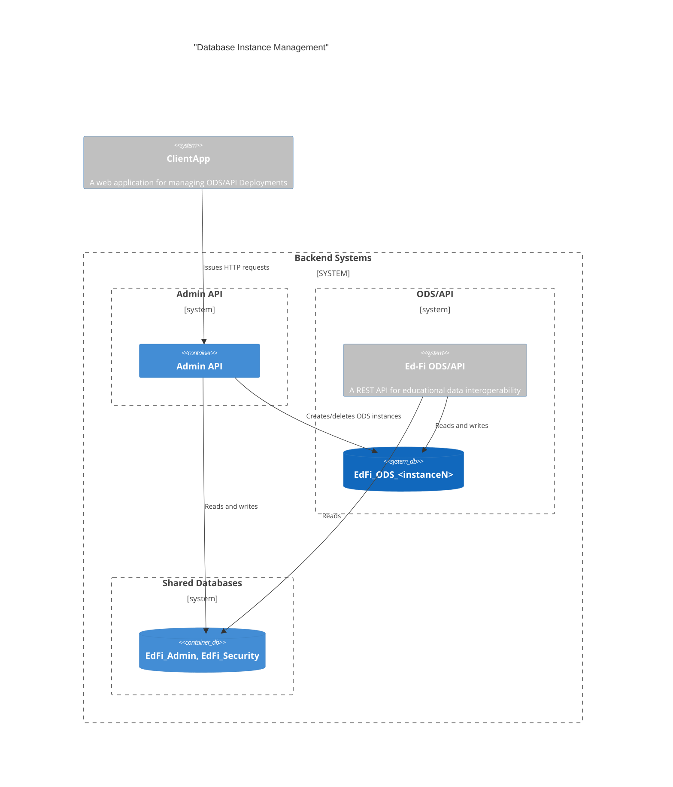
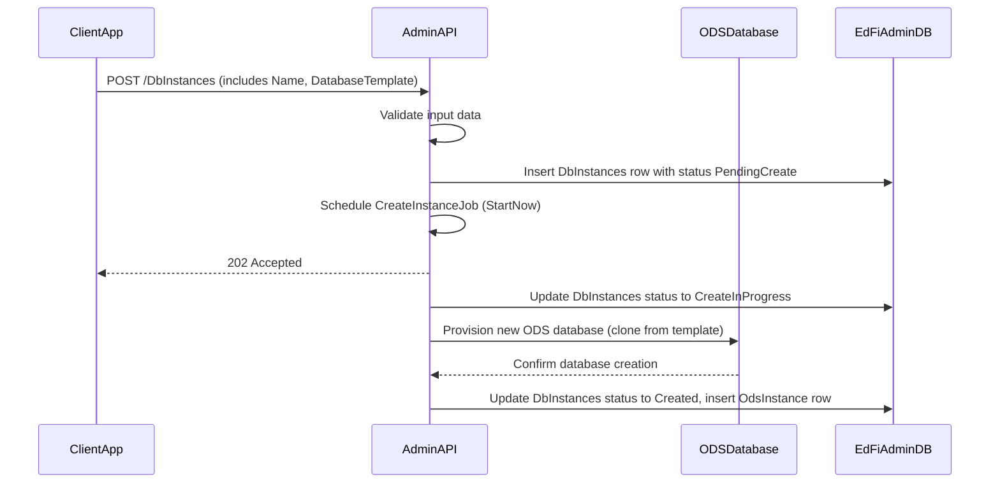
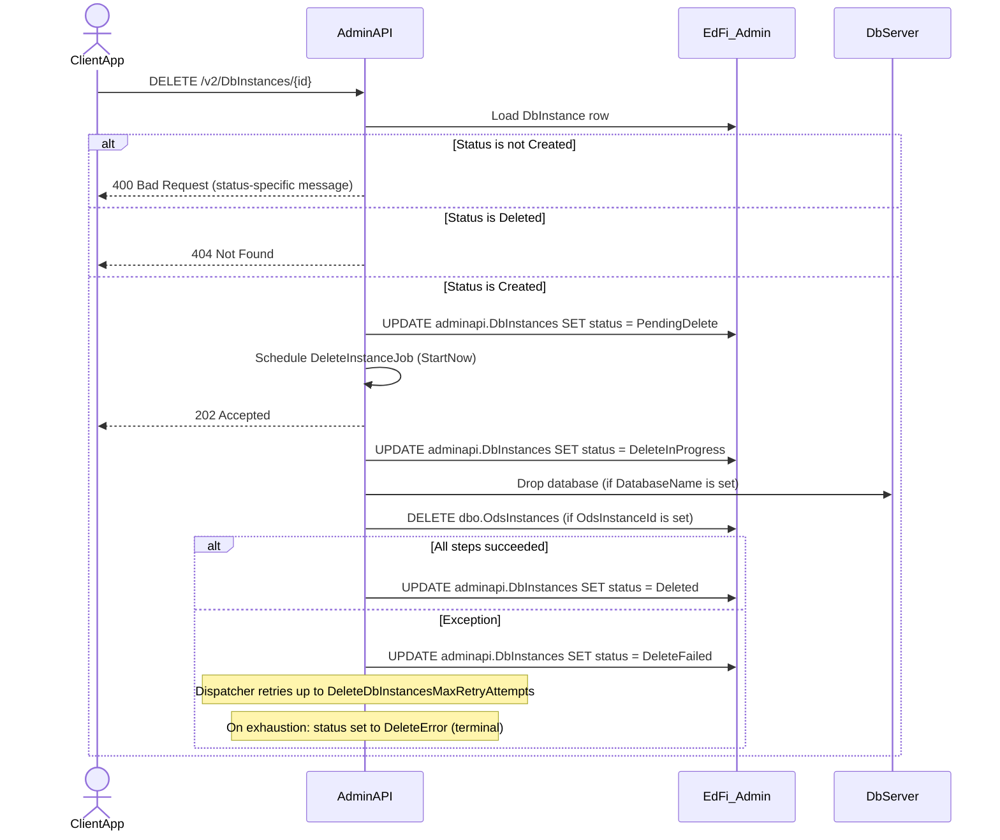

# Ed-Fi ODS Instance Management Design

This document describes the design and workflow for managing Ed-Fi ODS database
instances using the Admin API. All orchestration, job scheduling, and status
updates are handled by the Admin API, leveraging Quartz.NET for asynchronous
operations.

## API Endpoints Overview

Database instance management operations are performed on the
`adminapi.DbInstances` endpoint for direct database management (create, delete).

## System Architecture


```mermaid
C4Container
    title "Database Instance Management"

    System(ClientApp, "ClientApp", "A web application for managing ODS/API Deployments")
    UpdateElementStyle(ClientApp, $bgColor="silver")

    System_Boundary(backend, "Backend Systems") {
        Boundary(b0, "Admin API") {
            Container(AdminAPI, "Admin API")
        }

        Boundary(b1, "ODS/API") {
            System(OdsApi, "Ed-Fi ODS/API", "A REST API for educational data interoperability")
            UpdateElementStyle(OdsApi, $bgColor="silver")

            SystemDb(ods3, "EdFi_ODS_<instanceN>")
        }

        Boundary(b2, "Shared Databases") {
            ContainerDb(Admin, "EdFi_Admin, EdFi_Security")
        }
    }
   
    Rel(ClientApp, AdminAPI, "Issues HTTP requests")
    Rel(AdminAPI, ods3, "Creates/deletes ODS instances")
    Rel(OdsApi, ods3, "Reads and writes")
    Rel(AdminAPI, Admin, "Reads and writes")
    Rel(OdsApi, Admin, "Reads")
    UpdateLayoutConfig($c4ShapeInRow="2", $c4BoundaryInRow="2")
```

## Configuration

Two sets of database credentials are required for instance management
operations:

* **Regular DDL Credentials:** Used for standard data definition language (DDL)
  operations across all managed databases.
* **Admin Credentials:** Used for connecting to the `master` database. These
  credentials are required for all database management operations, such as
  creating or dropping databases.

This separation ensures that routine operations and sensitive management tasks
are handled securely and with appropriate permissions.

## Database table structure

```sql
CREATE TABLE [adminapi].[DbInstances] (
    [Id] INT IDENTITY(1,1) NOT NULL,
    [Name] NVARCHAR(100) NOT NULL,
    [OdsInstanceId] INT NOT NULL,
    [OdsInstanceName] NVARCHAR(100) NOT NULL, 
    [Status] NVARCHAR(75) NOT NULL,
    [DatabaseTemplate] NVARCHAR(100) NOT NULL,
    [DatabaseName] NVARCHAR(255) NULL,
    [LastRefreshed] DATETIME2 NOT NULL DEFAULT GETUTCDATE(),
    [LastModifiedDate] DATETIME2 NULL,
    CONSTRAINT [PK_DbInstances] PRIMARY KEY ([Id])
)
```

All operations update the `Status` field in `adminapi.DbInstances` to reflect the current state. Status values are pipeline-scoped and self-describing:

| Status | Pipeline | Meaning |
| --- | --- | --- |
| `PendingCreate` | Create | Queued for provisioning |
| `CreateInProgress` | Create | Worker is actively provisioning |
| `Created` | Create | Provisioning succeeded |
| `CreateFailed` | Create | Last attempt failed — retryable by dispatcher |
| `CreateError` | Create | Max retries exhausted — terminal |
| `PendingDelete` | Delete | Queued for deletion |
| `DeleteInProgress` | Delete | Worker is actively deleting |
| `Deleted` | Delete | Deletion succeeded |
| `DeleteFailed` | Delete | Last attempt failed — retryable by dispatcher |
| `DeleteError` | Delete | Max retries exhausted — terminal |

## DbInstances Endpoint Operations

The `DbInstances` endpoint supports the following operations:

* **Create Database Instance**: Provision a new ODS database instance. This
  operation creates a new record in `adminapi.DbInstances` and provisions the
  database using the specified template (minimal or populated/ sample).

```http
POST /v3/DbInstances
Authorization: Bearer <token>
{
  "name": "Database instance",
  "databaseTemplate": "minimal"
}
```

### Creating DbInstance

`POST /DbInstances` creates a new entry in the `adminapi.DbInstances` table with
a status of `PendingCreate`. This action schedules the `CreateInstanceJob` Quartz job,
which runs immediately. When the job starts, the status is updated to `CreateInProgress`.
If the database creation fails, the status changes to `CreateFailed` and the failure
details are logged. The `CreatePendingDbInstancesDispatcherJob` sweeps for `CreateFailed`
records and re-queues them up to the configured `CreateDbInstancesMaxRetryAttempts` limit;
once that limit is exceeded the status is set to `CreateError` (terminal). On successful
completion, the status is set to `Created` and a new record is added to the
`dbo.OdsInstances` table with the generated connection string.


```mermaid
sequenceDiagram
  participant ClientApp
  participant AdminAPI
  participant ODSDatabase
  participant EdFiAdminDB

  ClientApp->>AdminAPI: POST /DbInstances (includes Name, DatabaseTemplate)
  AdminAPI->>AdminAPI: Validate input data
  AdminAPI->>EdFiAdminDB: Insert DbInstances row with status PendingCreate
  AdminAPI->>AdminAPI: Schedule CreateInstanceJob (StartNow)
  AdminAPI-->>ClientApp: 202 Accepted
  AdminAPI->>EdFiAdminDB: Update DbInstances status to CreateInProgress
  AdminAPI->>ODSDatabase: Provision new ODS database (clone from template)
  ODSDatabase-->>AdminAPI: Confirm database creation
  AdminAPI->>EdFiAdminDB: Update DbInstances status to Created, insert OdsInstance row
```

### Creating OdsInstance

`POST /OdsInstances` creates a new entry in the `dbo.OdsInstances` table and
also adds a corresponding record to the `adminapi.DbInstances` table with:

* `OdsInstanceId`
* `OdsInstanceName`
* `DatabaseName` (from the connection string)
* Status set to "Completed"

Note: This operation does **not** initiate database creation.

> [!TIP]
> Admin API 2 on startup queries the `dbo.OdsInstances` table used by the
> ODS/API and inserts missing records into the `adminapi.DbInstances` with
> `Completed` status. This solves a potential synchronization problem between
> these two tables.

* **Delete Database Instance**: Remove an existing database instance. This is a
  soft delete; the `Status` field in `adminapi.DbInstances` is set to "DELETED"
  for audit purposes, and the database is dropped.

```http
DELETE /v3/DbInstances/{Id}
Authorization: Bearer <token>

```

### Deleting DbInstance (V2 — async pipeline)

`DELETE /v2/DbInstances/{id}` is an asynchronous operation. The endpoint validates the current
status, marks the record `PendingDelete`, schedules `DeleteInstanceJob`, and returns `202 Accepted`.
The physical database drop and `OdsInstance` row removal happen in the background job.

**Only `Created` instances are deletable via the endpoint.** Every other status is blocked:

| Status | Response | Reason |
| --- | --- | --- |
| `PendingCreate` | 400 | Create is in progress; deleting now would race with the create job. |
| `CreateInProgress` | 400 | Same race risk as `PendingCreate`. |
| `CreateFailed` | 400 | Create may have partially provisioned the database; requires human inspection before deletion. |
| `CreateError` | 400 | Same partial-provisioning risk as `CreateFailed`. |
| `PendingDelete` | 400 | Already queued for deletion. |
| `DeleteInProgress` | 400 | Deletion is actively executing. |
| `DeleteFailed` | 400 | Previous attempt failed; the dispatcher retries automatically. |
| `DeleteError` | 400 | Max retries exhausted; requires manual DB-level intervention. |
| `Deleted` | 404 | Treated as not found. |

On failure, `DeleteInstanceJob` sets the status to `DeleteFailed`. The `DeletePendingDbInstancesDispatcherJob`
sweeps for `DeleteFailed` records and re-queues them up to `DeleteDbInstancesMaxRetryAttempts`; once that
limit is exceeded the status is set to `DeleteError` (terminal).

Manual recovery from `CreateError` or `DeleteError`: fix the underlying database condition and reset the
row directly to `PendingCreate` or `PendingDelete` in the database.


```mermaid
sequenceDiagram
  actor ClientApp
  participant AdminAPI
  participant EdFi_Admin
  participant DbServer

  ClientApp ->> AdminAPI: DELETE /v2/DbInstances/{id}
  AdminAPI ->> EdFi_Admin: Load DbInstance row
  alt Status is not Created
    AdminAPI -->> ClientApp: 400 Bad Request (status-specific message)
  else Status is Deleted
    AdminAPI -->> ClientApp: 404 Not Found
  else Status is Created
    AdminAPI ->> EdFi_Admin: UPDATE adminapi.DbInstances SET status = PendingDelete
    AdminAPI ->> AdminAPI: Schedule DeleteInstanceJob (StartNow)
    AdminAPI -->> ClientApp: 202 Accepted
    AdminAPI ->> EdFi_Admin: UPDATE adminapi.DbInstances SET status = DeleteInProgress
    AdminAPI ->> DbServer: Drop database (if DatabaseName is set)
    AdminAPI ->> EdFi_Admin: DELETE dbo.OdsInstances (if OdsInstanceId is set)
    alt All steps succeeded
      AdminAPI ->> EdFi_Admin: UPDATE adminapi.DbInstances SET status = Deleted
    else Exception
      AdminAPI ->> EdFi_Admin: UPDATE adminapi.DbInstances SET status = DeleteFailed
      Note over AdminAPI: Dispatcher retries up to DeleteDbInstancesMaxRetryAttempts
      Note over AdminAPI: On exhaustion: status set to DeleteError (terminal)
    end
  end
```

### Read DbInstances

* **Read all database Instances**: Read instances with details (OdsInstanceId,
  OdsInstanceName, Status, DatabaseTemplate etc..).
  
* **Read database Instance by OdsInstance Id**: Read Instance details by
  OdsInstance id.
