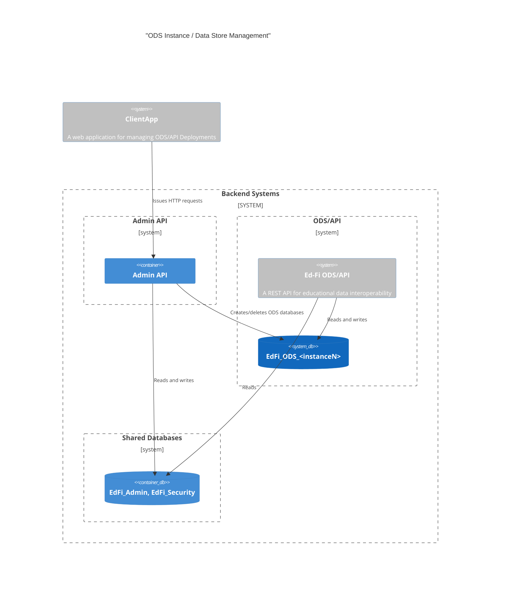
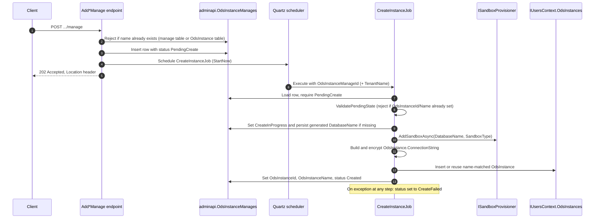
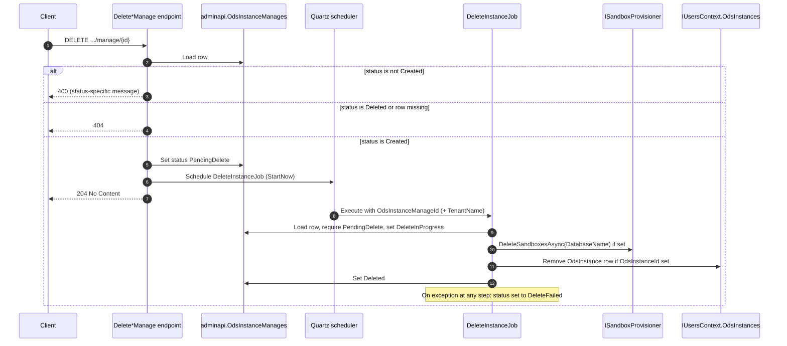

# Ed-Fi Admin API — ODS Instance / Data Store Management

This document describes the design and implementation of ODS database
instance management in the Admin API: on-demand provisioning and deletion of
ODS databases via REST endpoints, asynchronous processing through Quartz.NET
background jobs, and the sandbox provisioning layer that performs the actual
database operations.

The feature exists in two API surfaces that share the same underlying data
model and job infrastructure:

* **Admin API v2** — `OdsInstanceManage`, routed under `/v2/odsInstances/manage`
* **Admin API v3** — `DataStoreManage`, routed under `/v3/dataStores/manage`

A running process serves exactly one of v2 or v3, set via
`AppSettings:AdminApiMode` — never both in the same process. The C# code
defaults to `v2` when the setting is unset (`Program.cs`:
`GetValue<AdminApiMode>("AppSettings:AdminApiMode", AdminApiMode.V2)`), but the
checked-in `Application/EdFi.Ods.AdminApi/appsettings.json` sets `v3`, so an
unmodified deployment runs v3.

## System Architecture


```mermaid
C4Container
    title "ODS Instance / Data Store Management"

    System(ClientApp, "ClientApp", "A web application for managing ODS/API Deployments")
    UpdateElementStyle(ClientApp, $bgColor="silver")

    System_Boundary(backend, "Backend Systems") {
        Boundary(b0, "Admin API") {
            Container(AdminAPI, "Admin API")
        }

        Boundary(b1, "ODS/API") {
            System(OdsApi, "Ed-Fi ODS/API", "A REST API for educational data interoperability")
            UpdateElementStyle(OdsApi, $bgColor="silver")

            SystemDb(ods3, "EdFi_ODS_<instanceN>")
        }

        Boundary(b2, "Shared Databases") {
            ContainerDb(Admin, "EdFi_Admin, EdFi_Security")
        }
    }

    Rel(ClientApp, AdminAPI, "Issues HTTP requests")
    Rel(AdminAPI, ods3, "Creates/deletes ODS databases")
    Rel(OdsApi, ods3, "Reads and writes")
    Rel(AdminAPI, Admin, "Reads and writes")
    Rel(OdsApi, Admin, "Reads")
    UpdateLayoutConfig($c4ShapeInRow="2", $c4BoundaryInRow="2")
```

## Configuration and Prerequisites

### Database credentials

Two sets of database credentials are required:

* **Regular DDL credentials** (`ConnectionStrings:EdFi_Ods`) — used for
  standard data definition language operations on managed databases. This also
  supplies the connection-string *shape* that `CreateInstanceJob` rewrites (new
  database name substituted) into the persisted
  `OdsInstance.ConnectionString`.
* **Admin/maintenance credentials** (`ConnectionStrings:EdFi_Master`) — used
  for connecting to the maintenance database (`postgres` on PostgreSQL,
  `master` on SQL Server). Required for database create/drop operations. On
  PostgreSQL this must point at `postgres`, not at an ODS database.

### Other prerequisites

The feature only works end to end when all of the following hold:

* **`AppSettings:EncryptionKey` is set to a valid base64-encoded key.**
  `CreateInstanceJob` uses it to encrypt the `OdsInstance.ConnectionString` it
  persists (`BuildEncryptedConnectionString` does
  `_options.Value.EncryptionKey ?? throw new InvalidOperationException(...)`
  and then `Convert.FromBase64String`). A missing or non-base64 key throws on
  every create job, so every create lands in `CreateFailed` and eventually
  `CreateError` — with the database possibly already provisioned, since the
  encryption step runs *after* `AddSandboxAsync`.
* **`AppSettings:AdminApiMode` is `v2` or `v3`** — whichever mode is active,
  `Program.cs` only registers that mode's recurring dispatcher jobs at startup.
* **Quartz services are registered and the Quartz hosted service is enabled**,
  otherwise neither the immediately-scheduled worker jobs nor the recurring
  dispatchers ever run.
* **Admin API database migrations are applied**, so `adminapi.OdsInstanceManages`
  and `adminapi.JobStatuses` exist.
* **`AppSettings:DatabaseEngine` matches the actual platform**, since it selects
  the `ISandboxProvisioner` implementation once at startup (see
  [Provisioner selection](#provisioner-selection)).

### Multi-tenancy

When multi-tenancy is enabled (`AppSettings:MultiTenancy`), every configured
tenant must have its own `Tenants:{tenant}:ConnectionStrings:` entries for
**`EdFi_Admin`, `EdFi_Security`, `EdFi_Ods`, and `EdFi_Master`**. `EdFi_Ods`
and `EdFi_Master` are needed before a worker job runs for that tenant, since
`CreateInstanceJob` reads the tenant ODS shape directly from
`Tenants:{tenant}:ConnectionStrings:EdFi_Ods` and throws if it is absent (and
likewise needs the maintenance connection for create/drop). `EdFi_Security`
is not read by the worker path — `TenantSpecificDbContextProvider` only uses
`AdminConnectionString` (`EdFi_Admin`) to build tenant-specific
`AdminApiDbContext` / `IUsersContext` instances. Instead, `EdFi_Security` is
required because `TenantService.GetTenantsAsync`
(`Application/EdFi.Ods.AdminApi/Infrastructure/Services/Tenants/TenantService.cs:76`)
does `tenantConfig.Value.ConnectionStrings.First(p => p.Key == "EdFi_Security")`
for every tenant, which throws if any tenant is missing it — and this method
runs during startup dispatcher scheduling (`Program.cs`, the
`GetTenantsAsync(fromCache: true)` calls that feed the create/delete
dispatcher registration loops), so a tenant missing `EdFi_Security` breaks
dispatcher scheduling for *all* tenants at startup, not just itself.

## Data Model

Both v2 and v3 read and write the **same** underlying table — there is no
separate `DataStoreManage` table. `DataStoreManage` (v3) is purely an
API-facing name; the persisted entity is `OdsInstanceManage` for both
versions.

* Entity: `EdFi.Ods.AdminApi.Common.Infrastructure.Models.OdsInstanceManage`
* Table: `adminapi.OdsInstanceManages`
  (`Application/EdFi.Ods.AdminApi/Infrastructure/AdminApiDbContext.cs`)

```sql
CREATE TABLE [adminapi].[OdsInstanceManages] (
    [Id] INT IDENTITY(1,1) NOT NULL,
    [Name] NVARCHAR(100) NOT NULL,
    [OdsInstanceId] INT NULL,
    [OdsInstanceName] NVARCHAR(100) NULL,
    [Status] NVARCHAR(75) NOT NULL,
    [DatabaseTemplate] NVARCHAR(100) NOT NULL,
    [DatabaseName] NVARCHAR(255) NULL,
    [LastRefreshed] DATETIME2 NOT NULL DEFAULT GETUTCDATE(),
    [LastModifiedDate] DATETIME2 NULL,
    CONSTRAINT [PK_OdsInstanceManages] PRIMARY KEY ([Id])
)
```

The block above is the SQL Server shape (a PostgreSQL equivalent exists under
`Artifacts/PgSql/`) and shows columns only — the table also carries two
non-unique indexes: on `Name` and on `OdsInstanceId` (`IX_OdsInstanceManages_Name`
/ `IX_OdsInstanceManages_OdsInstanceId` on SQL Server;
`idx_odsinstancemanages_name` / `idx_odsinstancemanages_odsinstanceid` on
PostgreSQL).

> **Grepping the migrations?** There is no `CREATE TABLE ... OdsInstanceManages`
> statement anywhere in `Application/EdFi.Ods.AdminApi/Artifacts/`. The table was
> originally created as `adminapi.DbInstances` by
> `00005-CreateDbInstances.sql` and renamed (along with its primary key and both
> indexes) by `00007-RenameDbInstancesToOdsInstanceManages.sql`. Both files exist
> in `Artifacts/MsSql/Structure/Admin/` and `Artifacts/PgSql/Structure/Admin/`.

> **Note:** `DatabaseName` is 255 characters wide at the schema level, but the
> create-request validator additionally rejects any request whose *generated*
> database name would exceed 63 characters — see
> [Database name generation](#database-name-generation). The 63-char limit is
> an application business rule, not a schema constraint.

`OdsInstanceId` and `OdsInstanceName` are nullable because a management
record starts life with neither set — they're only populated once the create
job successfully provisions the database and links it to a real
`OdsInstance` row.

### Status values

Status is a plain string column. Values are pipeline-scoped and
self-describing — the `*Failed` variants are retryable, the `*Error`
variants are terminal:

| Status | Pipeline | Meaning |
| --- | --- | --- |
| `PendingCreate` | Create | Queued for provisioning |
| `CreateInProgress` | Create | Worker is actively provisioning |
| `Created` | Create | Provisioning succeeded |
| `CreateFailed` | Create | Last attempt failed — retryable by dispatcher |
| `CreateError` | Create | Max retries exhausted — terminal, manual fix required |
| `PendingDelete` | Delete | Queued for deletion |
| `DeleteInProgress` | Delete | Worker is actively deleting |
| `Deleted` | Delete | Deletion succeeded |
| `DeleteFailed` | Delete | Last attempt failed — retryable by dispatcher |
| `DeleteError` | Delete | Max retries exhausted — terminal, manual fix required |

## REST API

| Operation | v2 route | v3 route |
| --- | --- | --- |
| Create | `POST /v2/odsInstances/manage` | `POST /v3/dataStores/manage` |
| Read all | `GET /v2/odsInstances/manage` | `GET /v3/dataStores/manage` |
| Read by id | `GET /v2/odsInstances/manage/{id}` | `GET /v3/dataStores/manage/{id}` |
| Delete | `DELETE /v2/odsInstances/manage/{id}` | `DELETE /v3/dataStores/manage/{id}` |

v2 lives in `Application/EdFi.Ods.AdminApi/Features/OdsInstances/Manage/`; v3
in `Application/EdFi.Ods.AdminApi.V3/Features/DataStores/Manage/`. Behavior is
equivalent apart from four things:

1. the route path;
2. the `OdsInstanceManage` / `DataStoreManage` wording in **create-validator**
   error messages (`AddOdsInstanceManage.Validator` vs
   `AddDataStoreManage.Validator`) — the delete endpoint's status-blocked
   messages use identical `OdsInstanceManage` wording in both versions (see
   [Delete](#delete));
3. the POST `Location` header — v2 returns a **relative** path
   (`Results.Accepted($"/odsinstances/manage/{added.Id}", null)` in
   `AddOdsInstanceManage.Handle`), while v3 returns an **absolute** URL built by
   `ResourceUrlHelper.BuildAbsoluteResourceUrl(httpContext, AdminApiMode.V3, $"/dataStores/manage/{added.Id}")`
   in `AddDataStoreManage.Handle`, which is why v3's handler takes an extra
   `HttpContext` parameter that v2's does not;
4. the read response DTO field names — v2's `OdsInstanceManageModel` exposes
   `OdsInstanceId` / `OdsInstanceName`, while v3's `DataStoreManageModel`
   exposes `DataStoreId` / `DataStoreName`
   (`DataStoreManageMapper.ToModel` maps them straight from the same
   underlying `OdsInstanceManage.OdsInstanceId` / `OdsInstanceName` fields) —
   same underlying data, different field names on the wire.

Everything else in this section describes both versions together.

### Create

```http
POST /v2/odsInstances/manage
Authorization: Bearer <token>
Content-Type: application/json

{
  "name": "My New Instance",
  "databaseTemplate": "Minimal"
}
```

* `databaseTemplate` must be exactly `"Minimal"` or `"Sample"` (case-sensitive
  — these are the `SandboxType` enum member names, not free text).
* `name` must match `^[A-Za-z0-9 _]+$` and be 1–100 characters.
* The request is rejected if `name` (trimmed) already matches a non-`Deleted`
  `OdsInstanceManage.Name`, or an existing `OdsInstance.Name`.
* The request is rejected if the database name that would be generated from
  `name` + `databaseTemplate` (see below) would exceed 63 characters.
* On success, a new `OdsInstanceManage` row is inserted with status
  `PendingCreate`, `CreateInstanceJob` is scheduled to run immediately, and
  the endpoint returns **202 Accepted** with a `Location` header pointing at
  the new record. Provisioning happens later, in the background job — the
  response does not mean the database exists yet.

### Delete

```http
DELETE /v2/odsInstances/manage/{id}
Authorization: Bearer <token>
```

**Only `Created` records are deletable.** Every other status is blocked:

| Current status | Response | Reason |
| --- | --- | --- |
| `PendingCreate` | 400 | Create is queued; deleting now would race with the create job. |
| `CreateInProgress` | 400 | Create is actively executing; same race risk. |
| `CreateFailed` | 400 | Create may have partially provisioned the database; requires human inspection before deletion. |
| `CreateError` | 400 | Same partial-provisioning risk as `CreateFailed`. |
| `PendingDelete` | 400 | Already queued for deletion. |
| `DeleteInProgress` | 400 | Deletion is actively executing. |
| `DeleteFailed` | 400 | Previous attempt failed; the dispatcher retries automatically. |
| `DeleteError` | 400 | Max retries exhausted; requires manual DB-level intervention. |
| `Deleted` | 404 | Treated as not found. |
| *(id doesn't exist)* | 404 | Not found. |

On success, the endpoint sets status to `PendingDelete`, schedules
`DeleteInstanceJob` to run immediately, and returns **204 No Content**. The
physical database drop and `OdsInstance` row removal happen later, in the
background job.

> Both endpoints raise `ValidationException` (→ 400) or an
> `INotFoundException<int>` (→ 404) — there is no 422 anywhere in this path,
> in either API version.

### Database name generation

`OdsInstanceManageDatabaseNameFormatter` (v2) /
`DataStoreManageDatabaseNameFormatter` (v3) implement identical logic:

1. Normalize `name` and `databaseTemplate`: replace spaces with `_`, trim
   leading/trailing `_`.
2. Strip a leading `EdFi_Ods` prefix run from the normalized name
   (case-insensitive, matches one or more repeats with any underscore run).
3. Compose `EdFi_Ods_{name}_{databaseTemplate}`, or
   `EdFi_Ods_{databaseTemplate}` if step 2 left the name segment empty.

This value becomes `OdsInstanceManage.DatabaseName`, generated lazily by
`CreateInstanceJob` the first time it processes the row (not at POST time —
POST only validates that the *would-be* name fits within 63 characters).

## Background Jobs (Quartz.NET)

Both create and delete are asynchronous: the API endpoint only validates the
request and schedules a Quartz job; the actual database work happens in a
background worker.

### Jobs, per version

| Role | v2 class | v3 class |
| --- | --- | --- |
| Create worker | `CreateInstanceJob` (`EdFi.Ods.AdminApi...Jobs`) | `CreateInstanceJob` (`EdFi.Ods.AdminApi.V3...Jobs`) |
| Delete worker | `DeleteInstanceJob` | `DeleteInstanceJob` |
| Create dispatcher | `CreatePendingOdsInstanceManagesDispatcherJob` | `CreatePendingDataStoreManagesDispatcherJob` |
| Delete dispatcher | `DeletePendingOdsInstanceManagesDispatcherJob` | `DeletePendingDataStoreManagesDispatcherJob` |

The worker and dispatcher class *names* differ between v2 and v3, but the
Quartz **job-key strings** they schedule under come from the shared
`JobConstants` class
(`Application/EdFi.Ods.AdminApi.Common/Infrastructure/Jobs/JobConstants.cs`)
and are **identical** for both versions — e.g. both v2's and v3's create
dispatcher schedule under the literal string
`"CreatePendingOdsInstanceManagesDispatcherJob"`. There is no
`*DataStoreManages*`-named constant. This is safe only because a single
process runs exclusively the v2 job set *or* the v3 job set, gated by
`AdminApiMode` in `Program.cs` — never both in the same Quartz scheduler. If
that ever changed, the shared key strings would collide; treat this as a
latent fragility worth keeping in mind.

All four job classes inherit from `AdminApiQuartzJobBase`, which records
`InProgress`, `Completed`, or `Error` runs into `adminapi.JobStatuses` keyed
by job id and Quartz fire-instance id. This execution history is what the
dispatcher's retry counting (below) reads from.

### Create pipeline


```mermaid
sequenceDiagram
    autonumber
    participant Client
    participant API as Add*Manage endpoint
    participant Db as adminapi.OdsInstanceManages
    participant Quartz as Quartz scheduler
    participant Worker as CreateInstanceJob
    participant Provisioner as ISandboxProvisioner
    participant Users as IUsersContext.OdsInstances

    Client->>API: POST .../manage
    API->>Db: Reject if name already exists (manage table or OdsInstance table)
    API->>Db: Insert row with status PendingCreate
    API->>Quartz: Schedule CreateInstanceJob (StartNow)
    API-->>Client: 202 Accepted, Location header
    Quartz->>Worker: Execute with OdsInstanceManageId (+ TenantName)
    Worker->>Db: Load row, require PendingCreate
    Worker->>Worker: ValidatePendingState (reject if OdsInstanceId/Name already set)
    Worker->>Db: Set CreateInProgress and persist generated DatabaseName if missing
    Worker->>Provisioner: AddSandboxAsync(DatabaseName, SandboxType)
    Worker->>Worker: Build and encrypt OdsInstance.ConnectionString
    Worker->>Users: Insert or reuse name-matched OdsInstance
    Worker->>Db: Set OdsInstanceId, OdsInstanceName, status Created
    Note over Worker: On exception at any step: status set to CreateFailed
```

`ValidatePendingState` guards against processing a row that's already
partially linked: it throws if `OdsInstanceId` or `OdsInstanceName` is
already set, or if `DatabaseTemplate` is missing — either would mean the row
isn't the fresh `PendingCreate` row it claims to be.

Note the step ordering: `AddSandboxAsync` provisions the physical database
*before* the connection string is built and encrypted. The
connection string is derived from the configured `EdFi_Ods` shape with the
generated `DatabaseName` substituted, then encrypted with
`AppSettings:EncryptionKey` (see
[Configuration and Prerequisites](#configuration-and-prerequisites)). A missing
or invalid encryption key therefore fails the job only after the database
already exists.

### Delete pipeline


```mermaid
sequenceDiagram
    autonumber
    participant Client
    participant API as Delete*Manage endpoint
    participant Db as adminapi.OdsInstanceManages
    participant Quartz as Quartz scheduler
    participant Worker as DeleteInstanceJob
    participant Provisioner as ISandboxProvisioner
    participant Users as IUsersContext.OdsInstances

    Client->>API: DELETE .../manage/{id}
    API->>Db: Load row
    alt status is not Created
        API-->>Client: 400 (status-specific message)
    else status is Deleted or row missing
        API-->>Client: 404
    else status is Created
        API->>Db: Set status PendingDelete
        API->>Quartz: Schedule DeleteInstanceJob (StartNow)
        API-->>Client: 204 No Content
        Quartz->>Worker: Execute with OdsInstanceManageId (+ TenantName)
        Worker->>Db: Load row, require PendingDelete, set DeleteInProgress
        Worker->>Provisioner: DeleteSandboxesAsync(DatabaseName) if set
        Worker->>Users: Remove OdsInstance row if OdsInstanceId set
        Worker->>Db: Set Deleted
        Note over Worker: On exception at any step: status set to DeleteFailed
    end
```

### Job identity and payload

Worker jobs use a per-record Quartz key so retries and status tracking can
target one row (`CreateInstanceJob.BuildJobIdentity` /
`DeleteInstanceJob.BuildJobIdentity`; the name segment comes from
`JobConstants.CreateInstanceJobName` / `JobConstants.DeleteInstanceJobName`):

| Job | Single-tenant key | Multi-tenant key |
| --- | --- | --- |
| `CreateInstanceJob` | `CreateInstanceJob-{id}` | `CreateInstanceJob-{tenantName}-{id}` |
| `DeleteInstanceJob` | `DeleteInstanceJob-{id}` | `DeleteInstanceJob-{tenantName}-{id}` |

Dispatcher jobs use one fixed key per process (recurring, not per-record),
assembled in `Program.cs` at startup. Note the separator: workers use `-`,
dispatchers use `_` before the tenant name.

| Job | Single-tenant key | Multi-tenant key |
| --- | --- | --- |
| Create dispatcher (v2/v3 shared string) | `CreatePendingOdsInstanceManagesDispatcherJob` | `CreatePendingOdsInstanceManagesDispatcherJob_{tenantName}` |
| Delete dispatcher (v2/v3 shared string) | `DeletePendingOdsInstanceManagesDispatcherJob` | `DeletePendingOdsInstanceManagesDispatcherJob_{tenantName}` |

In multi-tenant mode one dispatcher pair is scheduled *per tenant*, each
carrying that tenant's name in its job data.

The job data map carries `JobConstants.OdsInstanceManageIdKey`
(`"OdsInstanceManageId"` — the record id) and, when multi-tenancy is enabled,
`JobConstants.TenantNameKey` (`"TenantName"`). Both worker jobs throw if
`OdsInstanceManageId` is absent, or if `TenantName` is absent while
multi-tenancy is on.

The dispatcher's retry count (see below) is derived by counting persisted
`adminapi.JobStatuses` rows whose `JobId` starts with `{workerJobKey}_` for that
record — `AdminApiQuartzJobBase` writes each run under
`{jobKey}_{fireInstanceId}`, so the worker's key is a prefix of every run it has
ever recorded for that row.

### Dispatcher sweep and retries

A recurring dispatcher job (scheduled at startup in `Program.cs`) scans for
records that need attention:

* **Create dispatcher** queries rows in `PendingCreate` or `CreateFailed` only.
* **Delete dispatcher** queries rows in `PendingDelete` or `DeleteFailed` only.

Neither dispatcher ever queries `CreateInProgress` or `DeleteInProgress` — see
[Known Limitations](#known-limitations).

For a `*Failed` row, the dispatcher counts prior `Error`-status
`adminapi.JobStatuses` rows matching that worker job's key prefix for this
record. If the count is below the configured max, the row is promoted back
to `Pending*` and re-queued; otherwise it's set to the terminal `*Error`
status.

| Configuration key | Value in `appsettings.json` | Controls |
| --- | --- | --- |
| `AppSettings:CreateOdsInstanceManagesSweepIntervalInMins` | 120 (5 in local Development config) | How often the create dispatcher runs |
| `AppSettings:DeleteOdsInstanceManagesSweepIntervalInMins` | 120 (5 in local Development config) | How often the delete dispatcher runs |
| `AppSettings:CreateOdsInstanceManagesMaxRetryAttempts` | 3 | Max retries for `CreateFailed` before `CreateError` |
| `AppSettings:DeleteOdsInstanceManagesMaxRetryAttempts` | 3 | Max retries for `DeleteFailed` before `DeleteError` |

The column above reports what the shipped `appsettings.json` files contain, not
the C# fallbacks. The `AppSettings` class defaults are different — 5 minutes for
each sweep interval and 3 for each max-retry count
(`Application/EdFi.Ods.AdminApi.Common/Settings/AppSettings.cs`).

**Operationally important:** the sweep-interval settings are read from raw
configuration in `Program.cs` and gated by `double.TryParse`. If a
sweep-interval value is absent or unparseable, that dispatcher is **not
scheduled at all** — startup logs an error
(`"Invalid value for ...SweepIntervalInMins"`) and continues, so the process
comes up healthy but no sweep-based recovery or retry ever happens. The
`AppSettings` C# default of 5 does not rescue this, because the scheduling
decision never consults the bound `AppSettings` object. In v3 mode the gate is
stricter still (`TryParse(...) && value > 0`), so a `0` also disables
scheduling.

Retry counts are derived from `adminapi.JobStatuses` execution history rather
than a dedicated counter column — this keeps retry accounting inside the
existing Quartz execution trail without additional schema changes. The
dispatcher falls back to a hardcoded `DefaultMaxRetryAttempts` of 3 if the
configured max-retry value is not greater than zero.

### Tenant context propagation

Quartz jobs run outside the HTTP pipeline, so the `TenantResolverMiddleware`
that normally sets the active tenant for HTTP requests never runs for them.
`CreateInstanceJob` and `DeleteInstanceJob` instead set the tenant context
explicitly at the start of execution (and clear it in a `finally` block) so
that `ConfigConnectionStringsProvider` and the sandbox provisioners resolve
the correct per-tenant connection strings. This context is carried through
`AsyncLocal`-based storage, which isolates each HTTP request's and each
Quartz job's context to its own logical execution chain.

## Sandbox Provisioning Layer

Both `CreateInstanceJob` and `DeleteInstanceJob` delegate the actual database
work to `ISandboxProvisioner`
(`Application/EdFi.Ods.AdminApi.InstanceManagement/Provisioners/`), shared by
v2 and v3:

```csharp
public interface ISandboxProvisioner
{
    void AddSandbox(string sandboxKey, SandboxType sandboxType);
    void DeleteSandboxes(params string[] databaseNames);
    void RenameSandbox(string oldName, string newName);
    SandboxStatus GetSandboxStatus(string databaseName);
    Task AddSandboxAsync(string sandboxKey, SandboxType sandboxType);
    Task DeleteSandboxesAsync(params string[] databaseNames);
    Task RenameSandboxAsync(string oldName, string newName);
    Task<SandboxStatus> GetSandboxStatusAsync(string databaseName);
    Task CopySandboxAsync(string originalDatabaseName, string newDatabaseName);
}
```

`SandboxStatus` carries exactly three fields — `Name`, `Code`, `Description`
— plus a static `ErrorStatus()` factory. There is no size, storage-usage, or
last-modified metadata anywhere on this type, and no `InstanceInfo`-style
operation exists on the interface — see [Known Limitations](#known-limitations).

### `SandboxProvisionerBase`

Abstract base class providing the common `AddSandboxAsync` template method:
it always calls `DeleteSandboxesAsync` on the target name first (clearing any
stale leftover), then `CopySandboxAsync` from the configured `Minimal` or
`Sample` template database. Concrete providers only need to implement
`DeleteSandboxesAsync`, `GetSandboxStatusAsync`, `RenameSandboxAsync`,
`CopySandboxAsync`, and `CreateConnection`.

### `PostgresSandboxProvisioner`

Uses Npgsql. `CopySandboxAsync` terminates existing connections to the source
database (`pg_terminate_backend`) and then runs:

```sql
CREATE DATABASE new_database_name TEMPLATE existing_database_name;
```

`GetSandboxStatusAsync` queries `pg_database`.

### `SqlServerSandboxProvisioner`

Uses `Microsoft.Data.SqlClient`. Unlike the Postgres provider, SQL Server has
no in-database template-copy mechanism, so `CopySandboxAsync` restores from a
**static, pre-configured `.bak` file** instead:

1. `RESTORE FILELISTONLY FROM DISK = '{bakFile}'` — discovers the logical
   data/log file names inside the backup.
2. `RESTORE DATABASE {new} FROM DISK = '{bakFile}' WITH REPLACE, MOVE ..., MOVE ...`
   — restores under the new database name, relocating the physical files.
3. Two `ALTER DATABASE ... MODIFY FILE` statements rename the physical
   data/log files to match the new database name.

The `.bak` file path comes from `AppSettings:SqlServerMinimalBakFile` /
`AppSettings:SqlServerSampleBakFile` — these are static files that must be
prepared and deployed out of band; there is **no** `BACKUP DATABASE` or
`DBCC` call anywhere in this provisioner. `GetSandboxStatusAsync` queries
`sys.databases`.

### Provisioner selection

Exactly one provisioner implementation is registered for the life of the
process, chosen once at startup in
`WebApplicationBuilderExtensions.RegisterSandboxProvisioningServices` based
on `AppSettings:DatabaseEngine`:

```csharp
if (parsedDatabaseEngine == DatabaseEngineEnum.PostgreSql)
    services.AddTransient<ISandboxProvisioner, PostgresSandboxProvisioner>();
else if (parsedDatabaseEngine == DatabaseEngineEnum.SqlServer)
    services.AddTransient<ISandboxProvisioner, SqlServerSandboxProvisioner>();
```

There is no per-request or per-tenant provisioner switching — the database
engine is a process-wide, boot-time configuration choice.

## Tenant Integration

`TenantService.GetTenantEdOrgsByInstancesAsync` (v2:
`Application/EdFi.Ods.AdminApi/Infrastructure/Services/Tenants/TenantService.cs`;
v3: `Application/EdFi.Ods.AdminApi.V3/Infrastructure/Services/Tenants/TenantService.cs`,
structurally identical) merges `OdsInstanceManage` data into the tenant
EdOrgs response:

1. Load real `OdsInstance` rows and their linked education organizations.
2. Load all `OdsInstanceManage` rows and group them by `OdsInstanceId`,
   keeping only the most-recently-modified row per group (by
   `LastModifiedDate ?? LastRefreshed`).
3. For each real `OdsInstance`, if a linked manage-row exists, overlay its
   `OdsInstanceManageId`, `Status`, `DatabaseTemplate`, and `DatabaseName`
   onto the response entry. If no manage-row is linked (e.g. a legacy or
   manually-created instance), the response defaults that instance's
   `Status` to `"Created"`.
4. Any manage-row that has no `OdsInstanceId` (still pending) or whose
   `OdsInstanceId` doesn't match a currently-existing instance (e.g. the
   instance was deleted directly, bypassing this feature) is appended
   separately as an "unlinked" entry, so in-flight or orphaned management
   records are still visible in the tenant view even though they have no
   backing ODS instance yet.

v3's version of this method operates on the same underlying
`OdsInstanceManage`/`OdsInstanceManageStatus` model — it does not have a
separate `DataStoreManage`-specific status enum.

## Known Limitations

* **No crash recovery for in-progress rows.** Neither dispatcher job queries
  `CreateInProgress` or `DeleteInProgress` — only `Pending*` and `*Failed`.
  If the API process crashes while `CreateInstanceJob` or `DeleteInstanceJob`
  is actively running, the affected row is stuck in an `*InProgress` status
  forever; no automatic sweep will ever pick it up. Recovery requires a
  human to inspect the actual state of the database and manually reset the
  row's `Status` (and `DatabaseName`/`OdsInstanceId` as appropriate) directly
  in `adminapi.OdsInstanceManages`.
* **No instance size/info query.** `ISandboxProvisioner` has no operation for
  reporting database size or other storage metadata. This was never
  implemented for either database engine.
* **Delete-success E2E test is disabled.** Both
  `DELETE - OdsInstance Manage - Success.bru.disabled` (v2) and
  `DELETE - DataStore Manage - Success.bru.disabled` (v3) are disabled
  (`.bru.disabled` extension plus `skip: true` in the `meta` block) because
  the CI Docker environment doesn't seed the `Minimal`/`Sample` template
  databases before the E2E suite runs, so the pre-request provisioning step
  the test depends on fails before the delete request is even issued.
  Re-enabling requires seeding those template databases in CI first.
