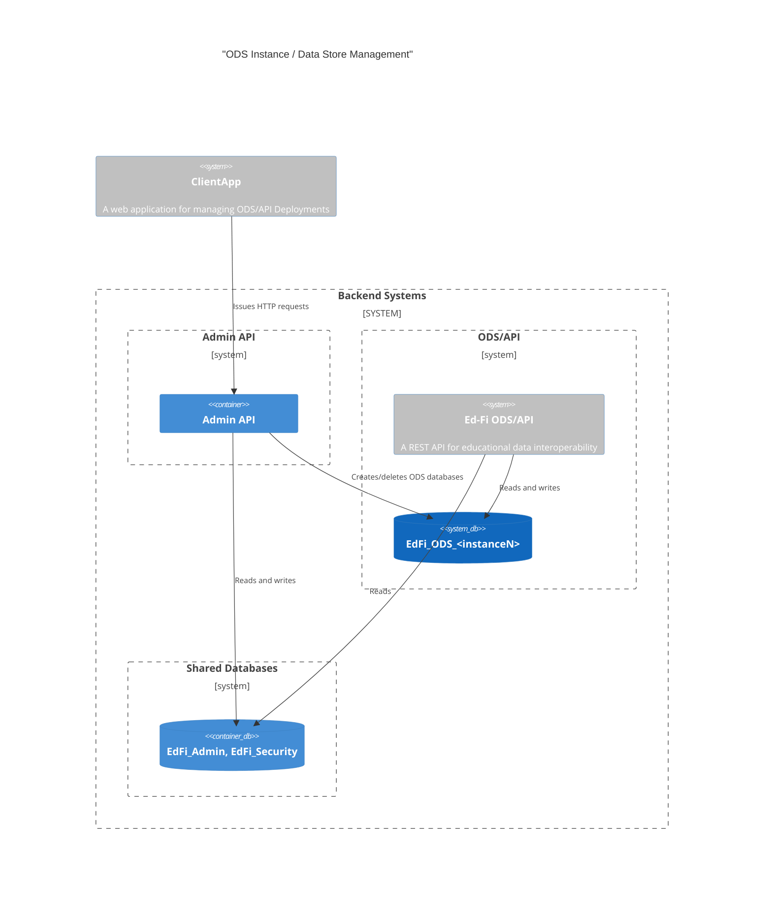

# Ed-Fi Admin API — ODS Instance / Data Store Management

This document describes the design and implementation of ODS database
instance management in the Admin API: on-demand provisioning and deletion of
ODS databases via REST endpoints, asynchronous processing through Quartz.NET
background jobs, and the sandbox provisioning layer that performs the actual
database operations.

The feature exists in two API surfaces that share the same underlying data
model and job infrastructure:

* **Admin API v2** — `OdsInstanceManage`, routed under `/v2/odsInstances/manage`
* **Admin API v3** — `DataStoreManage`, routed under `/v3/dataStores/manage`

A running process serves exactly one of v2 or v3, set via
`AppSettings:AdminApiMode` (default `v2`) — never both in the same process.

## System Architecture


```mermaid
C4Container
    title "ODS Instance / Data Store Management"

    System(ClientApp, "ClientApp", "A web application for managing ODS/API Deployments")
    UpdateElementStyle(ClientApp, $bgColor="silver")

    System_Boundary(backend, "Backend Systems") {
        Boundary(b0, "Admin API") {
            Container(AdminAPI, "Admin API")
        }

        Boundary(b1, "ODS/API") {
            System(OdsApi, "Ed-Fi ODS/API", "A REST API for educational data interoperability")
            UpdateElementStyle(OdsApi, $bgColor="silver")

            SystemDb(ods3, "EdFi_ODS_<instanceN>")
        }

        Boundary(b2, "Shared Databases") {
            ContainerDb(Admin, "EdFi_Admin, EdFi_Security")
        }
    }

    Rel(ClientApp, AdminAPI, "Issues HTTP requests")
    Rel(AdminAPI, ods3, "Creates/deletes ODS databases")
    Rel(OdsApi, ods3, "Reads and writes")
    Rel(AdminAPI, Admin, "Reads and writes")
    Rel(OdsApi, Admin, "Reads")
    UpdateLayoutConfig($c4ShapeInRow="2", $c4BoundaryInRow="2")
```

## Configuration

Two sets of database credentials are required:

* **Regular DDL credentials** (`ConnectionStrings:EdFi_Ods`) — used for
  standard data definition language operations on managed databases.
* **Admin/maintenance credentials** (`ConnectionStrings:EdFi_Master`) — used
  for connecting to the maintenance database (`postgres` on PostgreSQL,
  `master` on SQL Server). Required for database create/drop operations.

When multi-tenancy is enabled (`AppSettings:MultiTenancy`), each tenant must
have its own `Tenants:{tenant}:ConnectionStrings:EdFi_Ods` and
`Tenants:{tenant}:ConnectionStrings:EdFi_Master` entries.

## Data Model

Both v2 and v3 read and write the **same** underlying table — there is no
separate `DataStoreManage` table. `DataStoreManage` (v3) is purely an
API-facing name; the persisted entity is `OdsInstanceManage` for both
versions.

* Entity: `EdFi.Ods.AdminApi.Common.Infrastructure.Models.OdsInstanceManage`
* Table: `adminapi.OdsInstanceManages`
  (`Application/EdFi.Ods.AdminApi/Infrastructure/AdminApiDbContext.cs`)

```sql
CREATE TABLE [adminapi].[OdsInstanceManages] (
    [Id] INT IDENTITY(1,1) NOT NULL,
    [Name] NVARCHAR(100) NOT NULL,
    [OdsInstanceId] INT NULL,
    [OdsInstanceName] NVARCHAR(100) NULL,
    [Status] NVARCHAR(75) NOT NULL,
    [DatabaseTemplate] NVARCHAR(100) NOT NULL,
    [DatabaseName] NVARCHAR(255) NULL,
    [LastRefreshed] DATETIME2 NOT NULL DEFAULT GETUTCDATE(),
    [LastModifiedDate] DATETIME2 NULL,
    CONSTRAINT [PK_OdsInstanceManages] PRIMARY KEY ([Id])
)
```

> **Note:** `DatabaseName` is 255 characters wide at the schema level, but the
> create-request validator additionally rejects any request whose *generated*
> database name would exceed 63 characters — see
> [Database name generation](#database-name-generation). The 63-char limit is
> an application business rule, not a schema constraint.

`OdsInstanceId` and `OdsInstanceName` are nullable because a management
record starts life with neither set — they're only populated once the create
job successfully provisions the database and links it to a real
`OdsInstance` row.

### Status values

Status is a plain string column. Values are pipeline-scoped and
self-describing — the `*Failed` variants are retryable, the `*Error`
variants are terminal:

| Status | Pipeline | Meaning |
| --- | --- | --- |
| `PendingCreate` | Create | Queued for provisioning |
| `CreateInProgress` | Create | Worker is actively provisioning |
| `Created` | Create | Provisioning succeeded |
| `CreateFailed` | Create | Last attempt failed — retryable by dispatcher |
| `CreateError` | Create | Max retries exhausted — terminal, manual fix required |
| `PendingDelete` | Delete | Queued for deletion |
| `DeleteInProgress` | Delete | Worker is actively deleting |
| `Deleted` | Delete | Deletion succeeded |
| `DeleteFailed` | Delete | Last attempt failed — retryable by dispatcher |
| `DeleteError` | Delete | Max retries exhausted — terminal, manual fix required |

## REST API

| Operation | v2 route | v3 route |
| --- | --- | --- |
| Create | `POST /v2/odsInstances/manage` | `POST /v3/dataStores/manage` |
| Read all | `GET /v2/odsInstances/manage` | `GET /v3/dataStores/manage` |
| Read by id | `GET /v2/odsInstances/manage/{id}` | `GET /v3/dataStores/manage/{id}` |
| Delete | `DELETE /v2/odsInstances/manage/{id}` | `DELETE /v3/dataStores/manage/{id}` |

v2 lives in `Application/EdFi.Ods.AdminApi/Features/OdsInstances/Manage/`; v3
in `Application/EdFi.Ods.AdminApi.V3/Features/DataStores/Manage/`. Behavior is
byte-for-byte identical between the two — only the route path and the
"OdsInstanceManage"/"DataStoreManage" wording in error messages differ. The
rest of this section describes both together.

### Create

```http
POST /v2/odsInstances/manage
Authorization: Bearer <token>
Content-Type: application/json

{
  "name": "My New Instance",
  "databaseTemplate": "Minimal"
}
```

* `databaseTemplate` must be exactly `"Minimal"` or `"Sample"` (case-sensitive
  — these are the `SandboxType` enum member names, not free text).
* `name` must match `^[A-Za-z0-9 _]+$` and be 1–100 characters.
* The request is rejected if `name` (trimmed) already matches a non-`Deleted`
  `OdsInstanceManage.Name`, or an existing `OdsInstance.Name`.
* The request is rejected if the database name that would be generated from
  `name` + `databaseTemplate` (see below) would exceed 63 characters.
* On success, a new `OdsInstanceManage` row is inserted with status
  `PendingCreate`, `CreateInstanceJob` is scheduled to run immediately, and
  the endpoint returns **202 Accepted** with a `Location` header pointing at
  the new record. Provisioning happens later, in the background job — the
  response does not mean the database exists yet.

### Delete

```http
DELETE /v2/odsInstances/manage/{id}
Authorization: Bearer <token>
```

**Only `Created` records are deletable.** Every other status is blocked:

| Current status | Response | Reason |
| --- | --- | --- |
| `PendingCreate` | 400 | Create is queued; deleting now would race with the create job. |
| `CreateInProgress` | 400 | Create is actively executing; same race risk. |
| `CreateFailed` | 400 | Create may have partially provisioned the database; requires human inspection before deletion. |
| `CreateError` | 400 | Same partial-provisioning risk as `CreateFailed`. |
| `PendingDelete` | 400 | Already queued for deletion. |
| `DeleteInProgress` | 400 | Deletion is actively executing. |
| `DeleteFailed` | 400 | Previous attempt failed; the dispatcher retries automatically. |
| `DeleteError` | 400 | Max retries exhausted; requires manual DB-level intervention. |
| `Deleted` | 404 | Treated as not found. |
| *(id doesn't exist)* | 404 | Not found. |

On success, the endpoint sets status to `PendingDelete`, schedules
`DeleteInstanceJob` to run immediately, and returns **204 No Content**. The
physical database drop and `OdsInstance` row removal happen later, in the
background job.

> Both endpoints raise `ValidationException` (→ 400) or an
> `INotFoundException<int>` (→ 404) — there is no 422 anywhere in this path,
> in either API version.

### Database name generation

`OdsInstanceManageDatabaseNameFormatter` (v2) /
`DataStoreManageDatabaseNameFormatter` (v3) implement identical logic:

1. Normalize `name` and `databaseTemplate`: replace spaces with `_`, trim
   leading/trailing `_`.
2. Strip a leading `EdFi_Ods` prefix run from the normalized name
   (case-insensitive, matches one or more repeats with any underscore run).
3. Compose `EdFi_Ods_{name}_{databaseTemplate}`, or
   `EdFi_Ods_{databaseTemplate}` if step 2 left the name segment empty.

This value becomes `OdsInstanceManage.DatabaseName`, generated lazily by
`CreateInstanceJob` the first time it processes the row (not at POST time —
POST only validates that the *would-be* name fits within 63 characters).
