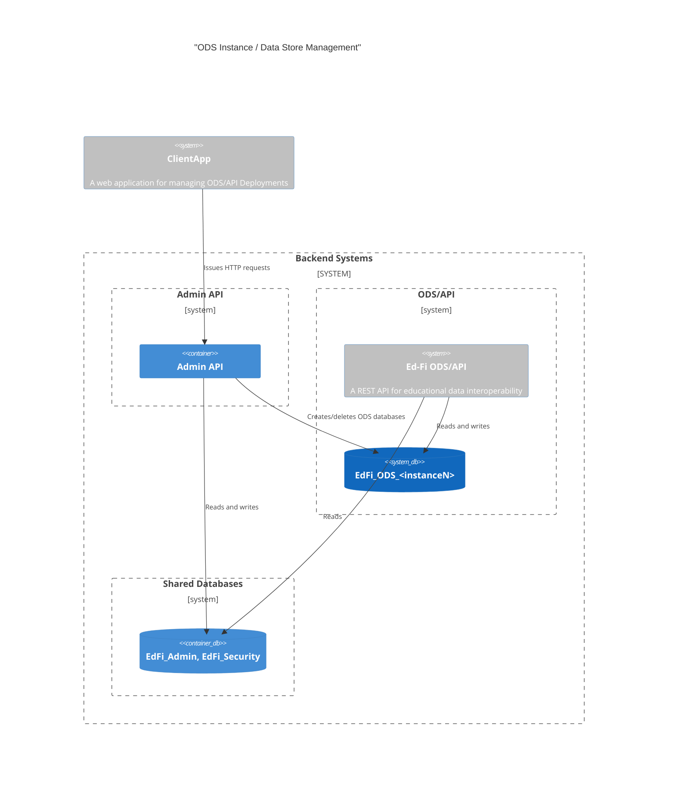

# Ed-Fi Admin API — ODS Instance / Data Store Management

This document describes the design and implementation of ODS database
instance management in the Admin API: on-demand provisioning and deletion of
ODS databases via REST endpoints, asynchronous processing through Quartz.NET
background jobs, and the sandbox provisioning layer that performs the actual
database operations.

The feature exists in two API surfaces that share the same underlying data
model and job infrastructure:

* **Admin API v2** — `OdsInstanceManage`, routed under `/v2/odsInstances/manage`
* **Admin API v3** — `DataStoreManage`, routed under `/v3/dataStores/manage`

A running process serves exactly one of v2 or v3, set via
`AppSettings:AdminApiMode` (default `v2`) — never both in the same process.

## System Architecture

```mermaid
C4Container
    title "ODS Instance / Data Store Management"

    System(ClientApp, "ClientApp", "A web application for managing ODS/API Deployments")
    UpdateElementStyle(ClientApp, $bgColor="silver")

    System_Boundary(backend, "Backend Systems") {
        Boundary(b0, "Admin API") {
            Container(AdminAPI, "Admin API")
        }

        Boundary(b1, "ODS/API") {
            System(OdsApi, "Ed-Fi ODS/API", "A REST API for educational data interoperability")
            UpdateElementStyle(OdsApi, $bgColor="silver")

            SystemDb(ods3, "EdFi_ODS_<instanceN>")
        }

        Boundary(b2, "Shared Databases") {
            ContainerDb(Admin, "EdFi_Admin, EdFi_Security")
        }
    }

    Rel(ClientApp, AdminAPI, "Issues HTTP requests")
    Rel(AdminAPI, ods3, "Creates/deletes ODS databases")
    Rel(OdsApi, ods3, "Reads and writes")
    Rel(AdminAPI, Admin, "Reads and writes")
    Rel(OdsApi, Admin, "Reads")
    UpdateLayoutConfig($c4ShapeInRow="2", $c4BoundaryInRow="2")
```

## Configuration

Two sets of database credentials are required:

* **Regular DDL credentials** (`ConnectionStrings:EdFi_Ods`) — used for
  standard data definition language operations on managed databases.
* **Admin/maintenance credentials** (`ConnectionStrings:EdFi_Master`) — used
  for connecting to the maintenance database (`postgres` on PostgreSQL,
  `master` on SQL Server). Required for database create/drop operations.

When multi-tenancy is enabled (`AppSettings:MultiTenancy`), each tenant must
have its own `Tenants:{tenant}:ConnectionStrings:EdFi_Ods` and
`Tenants:{tenant}:ConnectionStrings:EdFi_Master` entries.
