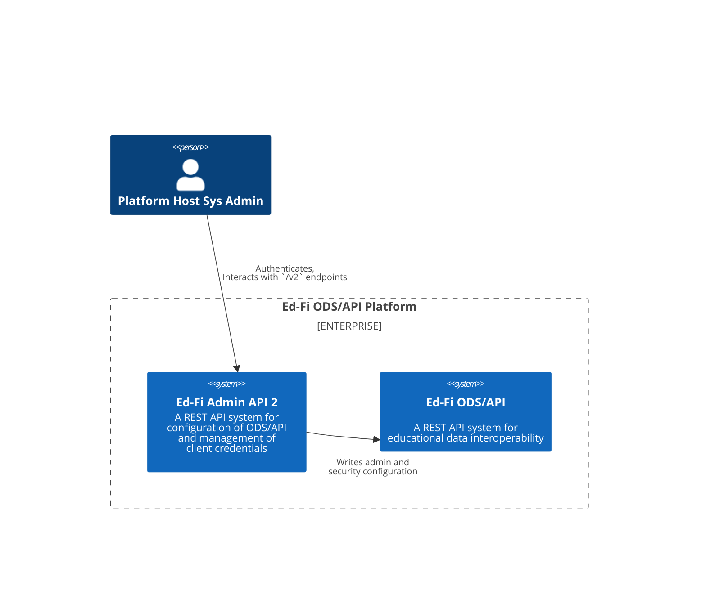
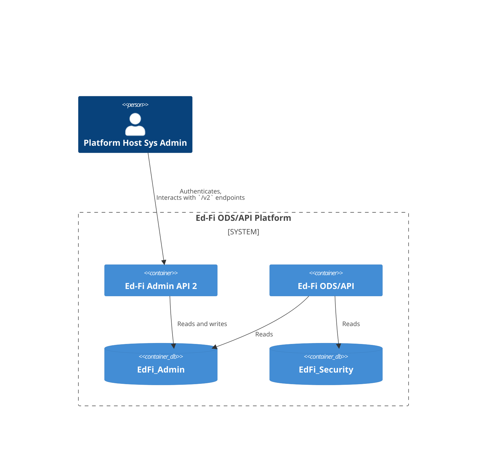
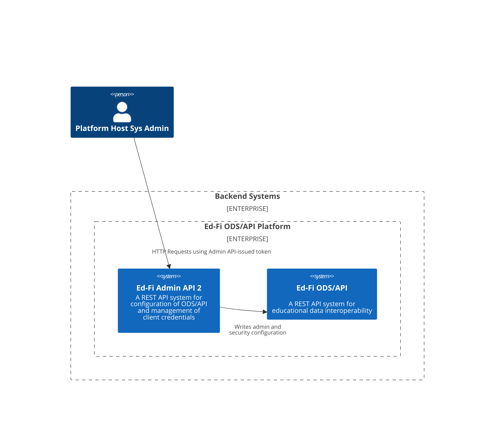
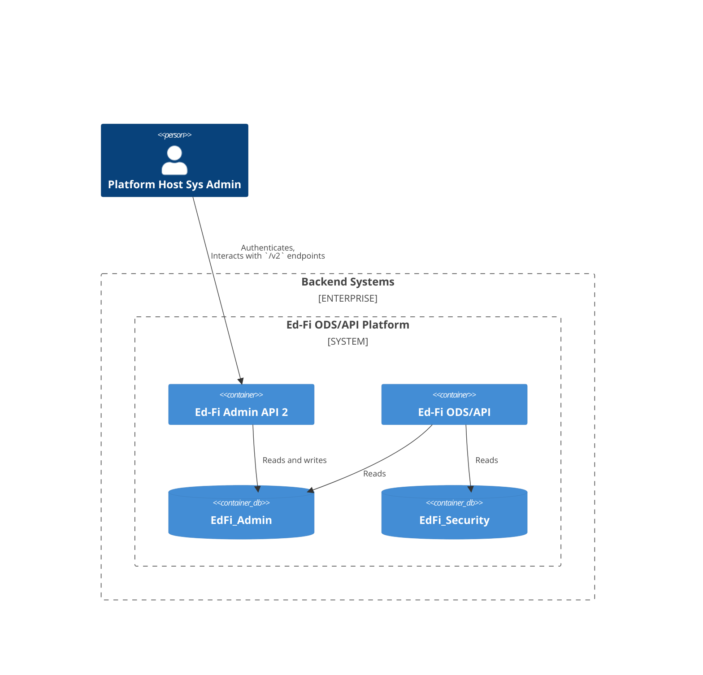
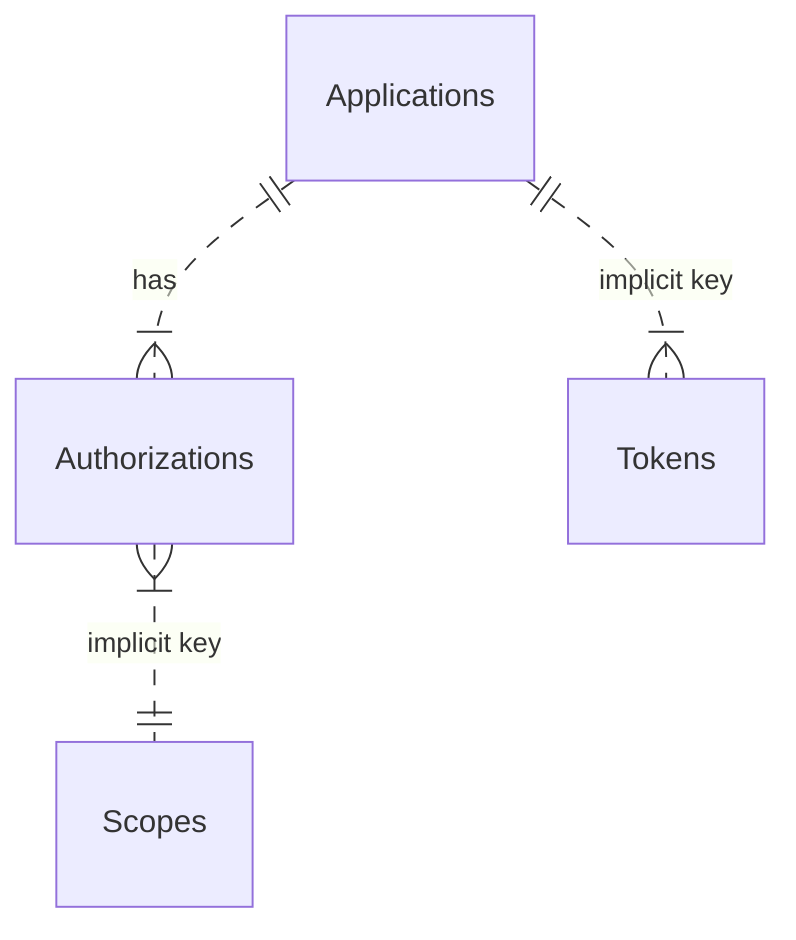

# Authentication and Authorization in Admin API 2.x

Admin API 2 uses [OAuth 2](https://oauth.net/2/) and the [OpenID
Connect](https://openid.net/) ("OIDC") protocol for managing API authentication
and authorization.

## Versions 2.0, 2.1, and 2.2

### System Context 2.0 through 2.2

System administrators interact directly with Admin API to perform ODS/API
configuration tasks and manage client credentials. Authentication and
authorization are [self-contained](./SELF-CONTAINED.md): there is no need for a
third party Identity Provider (IdP). There is a single `OAuth` scope available:
`edfi_admin_api/full_access`.

### Containers 2.0 through 2.2

## Version 2.3 and above

### Self-Contained Authentication

The [self-contained authentication](./SELF-CONTAINED.md) in Admin API 2.0
through 2.2 was adequate for the application's needs. This support provided
only the `client_credentials` grant flow. OpenIddict _can_ support users, not
just clients, but the support was unnecessary at the time. With the introduction
of Ed-Fi Admin App, a user interface that is backed
by Admin API, there is a need for additional capabilities for managing users,
supporting other flows, and providing a user sign-in page.

Admin API continues to rely exclusively on its self-contained OpenIddict
authentication for both direct API consumers and Admin App; no third-party
Identity Provider integration is required or supported.

### System Context 2.3+

### System Containers 2.3+

The containers look exactly as in Admin API 2.0 through 2.2 — Admin App uses
the same self-contained authentication.

## Solution Design

### Self-Contained Authentication with OpenIddict

Admin API integrates [OpenIddict](https://openiddict.com/) directly into its own
application source code. Client credentials are created via the `/connect/register` endpoint following a
custom protocol. Tokens are generated via the `/connect/token` endpoint.

This integration uses the following database tables:

> [!NOTE]
> "implicit key" in this diagram means that there is no foreign key relationship
> in the database. The author does not know why there is no foreign key, but
> presumably it is for a good reason.
