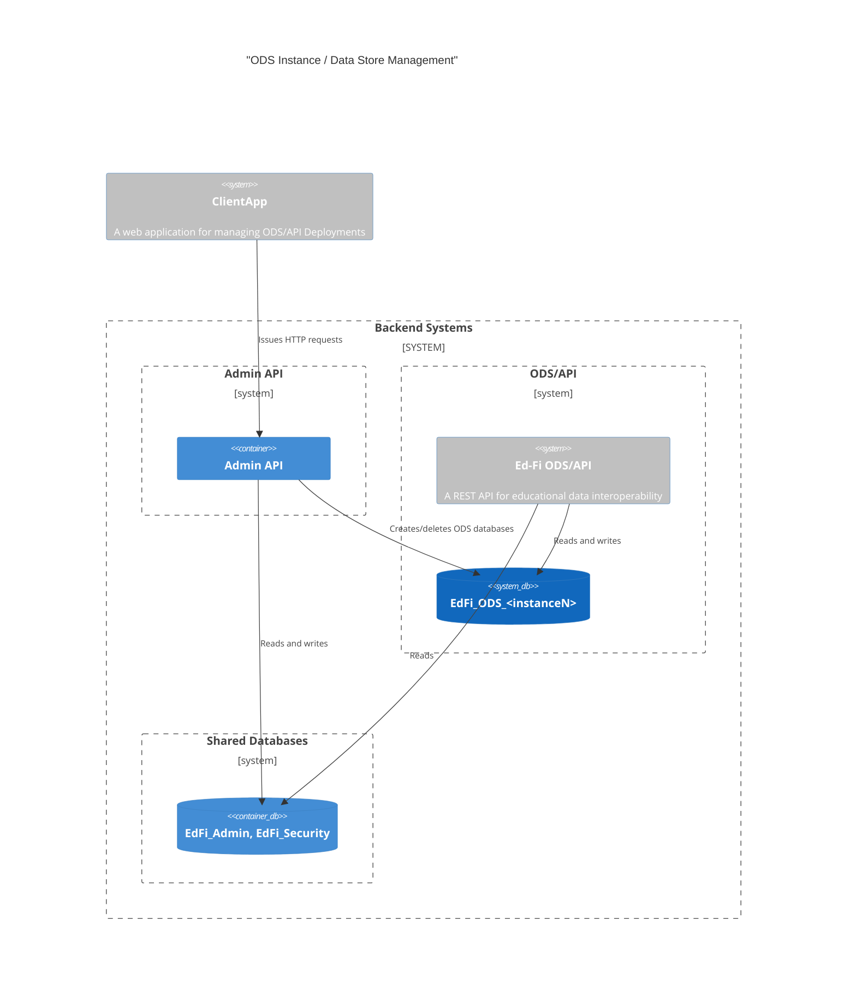
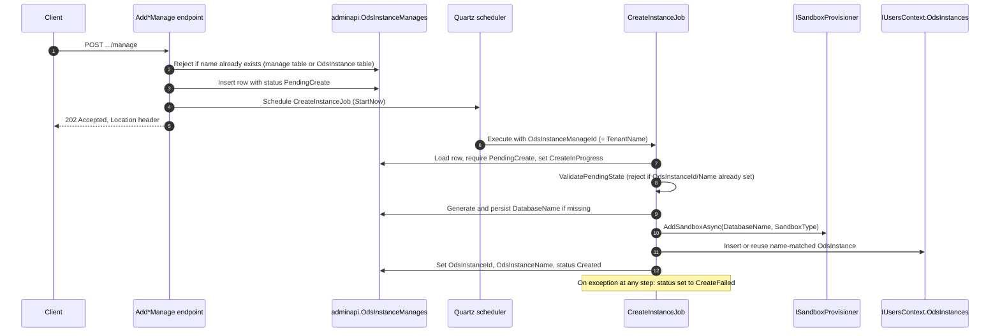
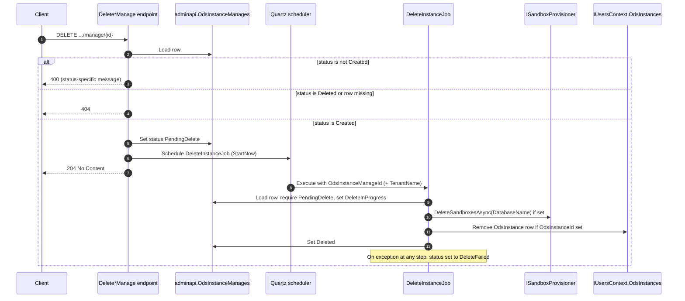

# Instance/DataStore Management Docs Rewrite Implementation Plan

> **For agentic workers:** REQUIRED SUB-SKILL: Use superpowers:subagent-driven-development (recommended) or superpowers:executing-plans to implement this plan task-by-task. Steps use checkbox (`- [ ]`) syntax for tracking.

**Goal:** Replace three stale design docs (`INSTANCE-MANAGEMENT.md`, `INSTANCE-MANAGEMENT-Quartz.md`, `INSTANCE-MANAGEMENT-Service.md`) with a single accurate, consolidated `docs/design/INSTANCE-MANAGEMENT.md`, and fix the two stale cross-references that point at the old file set.

**Architecture:** This is a documentation-only change — no application code is touched. The consolidated doc is built up section-by-section across tasks 1–6 (Overview → Data Model → REST API → Background Jobs → Sandbox Provisioning → Tenant Integration/Known Limitations), then task 7 deletes the two now-redundant files and repairs the two stale cross-references, followed by a final whole-document accuracy sweep.

**Tech Stack:** Markdown, Mermaid (C4Container / sequenceDiagram diagrams), git.

## Global Constraints

* No `DbInstance`/`DbDataStore` naming may remain anywhere in the new doc — see spec §"Verified facts driving corrections".
* v2 and v3 are described together in one narrative; differences are called out inline only where they actually diverge (spec: single-narrative decision).
* The tenant-context-propagation historical bug writeup is compressed to one short paragraph — no race-condition narrative or rejected-alternatives discussion (spec decision).
* The unmerged `EnableDataStoreManagement` feature flag (`ADMINAPI-1489`) and any uncommitted local `appsettings.json`/`appsettings.Development.json` changes are out of scope and must not be documented as current behavior.
* Every fact in the new doc must trace to the "Verified facts driving corrections" section of `docs/superpowers/specs/2026-08-07-instance-management-docs-rewrite-design.md` — do not introduce unverified claims (e.g. don't invent config key names or defaults not confirmed there).
* Follow `.editorconfig` / repo Markdown conventions already used in `docs/design/*.md` (ATX headers, fenced code blocks with language tags, GitHub-flavored Mermaid fences).

---

## Task 1: Scaffold the doc — Overview, Architecture, Configuration

**Files:**
- Create: `docs/design/INSTANCE-MANAGEMENT.md`

**Interfaces:**
- Produces: the file itself, ending in a `## Configuration` section whose last line is `` `Tenants:{tenant}:ConnectionStrings:EdFi_Master` entries.`` — Task 2 anchors its insertion there.

- [ ] **Step 1: Write the file**

Create `docs/design/INSTANCE-MANAGEMENT.md` with exactly this content:

```markdown
# Ed-Fi Admin API — ODS Instance / Data Store Management

This document describes the design and implementation of ODS database
instance management in the Admin API: on-demand provisioning and deletion of
ODS databases via REST endpoints, asynchronous processing through Quartz.NET
background jobs, and the sandbox provisioning layer that performs the actual
database operations.

The feature exists in two API surfaces that share the same underlying data
model and job infrastructure:

* **Admin API v2** — `OdsInstanceManage`, routed under `/v2/odsInstances/manage`
* **Admin API v3** — `DataStoreManage`, routed under `/v3/dataStores/manage`

A running process serves exactly one of v2 or v3, set via
`AppSettings:AdminApiMode` (default `v2`) — never both in the same process.

## System Architecture



## Configuration

Two sets of database credentials are required:

* **Regular DDL credentials** (`ConnectionStrings:EdFi_Ods`) — used for
  standard data definition language operations on managed databases.
* **Admin/maintenance credentials** (`ConnectionStrings:EdFi_Master`) — used
  for connecting to the maintenance database (`postgres` on PostgreSQL,
  `master` on SQL Server). Required for database create/drop operations.

When multi-tenancy is enabled (`AppSettings:MultiTenancy`), each tenant must
have its own `Tenants:{tenant}:ConnectionStrings:EdFi_Ods` and
`Tenants:{tenant}:ConnectionStrings:EdFi_Master` entries.
```

- [ ] **Step 2: Verify no stale naming and the anchor line is present**

Run:
```bash
grep -c "DbInstance\|DbDataStore" docs/design/INSTANCE-MANAGEMENT.md
tail -3 docs/design/INSTANCE-MANAGEMENT.md
```
Expected: first command prints `0`; `tail` shows the `Tenants:{tenant}:ConnectionStrings:EdFi_Master` line as the last line of the file.

- [ ] **Step 3: Commit**

```bash
git add docs/design/INSTANCE-MANAGEMENT.md
git commit -m "docs(ADMINAPI-1485): scaffold consolidated instance management doc"
```

---

## Task 2: Data Model section

**Files:**
- Modify: `docs/design/INSTANCE-MANAGEMENT.md` (append after Task 1's content)

**Interfaces:**
- Consumes: the file ending in the `Tenants:{tenant}:ConnectionStrings:EdFi_Master` line (Task 1's anchor).
- Produces: file now ends with the Status values table; last row is `| \`DeleteError\` | Delete | Max retries exhausted — terminal, manual fix required |`.

- [ ] **Step 1: Append the Data Model section**

Use Edit with `old_string` set to the last line of Task 1's file:
```
`Tenants:{tenant}:ConnectionStrings:EdFi_Master` entries.
```
and `new_string`:
```
`Tenants:{tenant}:ConnectionStrings:EdFi_Master` entries.

## Data Model

Both v2 and v3 read and write the **same** underlying table — there is no
separate `DataStoreManage` table. `DataStoreManage` (v3) is purely an
API-facing name; the persisted entity is `OdsInstanceManage` for both
versions.

* Entity: `EdFi.Ods.AdminApi.Common.Infrastructure.Models.OdsInstanceManage`
* Table: `adminapi.OdsInstanceManages`
  (`Application/EdFi.Ods.AdminApi/Infrastructure/AdminApiDbContext.cs`)

```sql
CREATE TABLE [adminapi].[OdsInstanceManages] (
    [Id] INT IDENTITY(1,1) NOT NULL,
    [Name] NVARCHAR(100) NOT NULL,
    [OdsInstanceId] INT NULL,
    [OdsInstanceName] NVARCHAR(100) NULL,
    [Status] NVARCHAR(75) NOT NULL,
    [DatabaseTemplate] NVARCHAR(100) NOT NULL,
    [DatabaseName] NVARCHAR(255) NULL,
    [LastRefreshed] DATETIME2 NOT NULL DEFAULT GETUTCDATE(),
    [LastModifiedDate] DATETIME2 NULL,
    CONSTRAINT [PK_OdsInstanceManages] PRIMARY KEY ([Id])
)
```

> **Note:** `DatabaseName` is 255 characters wide at the schema level, but the
> create-request validator additionally rejects any request whose *generated*
> database name would exceed 63 characters — see
> [Database name generation](#database-name-generation). The 63-char limit is
> an application business rule, not a schema constraint.

`OdsInstanceId` and `OdsInstanceName` are nullable because a management
record starts life with neither set — they're only populated once the create
job successfully provisions the database and links it to a real
`OdsInstance` row.

### Status values

Status is a plain string column. Values are pipeline-scoped and
self-describing — the `*Failed` variants are retryable, the `*Error`
variants are terminal:

| Status | Pipeline | Meaning |
| --- | --- | --- |
| `PendingCreate` | Create | Queued for provisioning |
| `CreateInProgress` | Create | Worker is actively provisioning |
| `Created` | Create | Provisioning succeeded |
| `CreateFailed` | Create | Last attempt failed — retryable by dispatcher |
| `CreateError` | Create | Max retries exhausted — terminal, manual fix required |
| `PendingDelete` | Delete | Queued for deletion |
| `DeleteInProgress` | Delete | Worker is actively deleting |
| `Deleted` | Delete | Deletion succeeded |
| `DeleteFailed` | Delete | Last attempt failed — retryable by dispatcher |
| `DeleteError` | Delete | Max retries exhausted — terminal, manual fix required |
```

- [ ] **Step 2: Verify**

Run:
```bash
grep -c "DbInstance\|DbDataStore" docs/design/INSTANCE-MANAGEMENT.md
grep -c "NOT NULL\], not the schema" docs/design/INSTANCE-MANAGEMENT.md || true
tail -3 docs/design/INSTANCE-MANAGEMENT.md
```
Expected: first command prints `0`; `tail` ends with the `DeleteError` row of the Status values table.

- [ ] **Step 3: Commit**

```bash
git add docs/design/INSTANCE-MANAGEMENT.md
git commit -m "docs(ADMINAPI-1485): add data model section"
```

---

## Task 3: REST API section

**Files:**
- Modify: `docs/design/INSTANCE-MANAGEMENT.md` (append after Task 2's content)

**Interfaces:**
- Consumes: file ending in the Status values table's `DeleteError` row (Task 2's anchor).
- Produces: file now ends with the Database name generation subsection.

- [ ] **Step 1: Append the REST API section**

Use Edit with `old_string`:
```
| `DeleteError` | Delete | Max retries exhausted — terminal, manual fix required |
```
and `new_string`:
```
| `DeleteError` | Delete | Max retries exhausted — terminal, manual fix required |

## REST API

| Operation | v2 route | v3 route |
| --- | --- | --- |
| Create | `POST /v2/odsInstances/manage` | `POST /v3/dataStores/manage` |
| Read all | `GET /v2/odsInstances/manage` | `GET /v3/dataStores/manage` |
| Read by id | `GET /v2/odsInstances/manage/{id}` | `GET /v3/dataStores/manage/{id}` |
| Delete | `DELETE /v2/odsInstances/manage/{id}` | `DELETE /v3/dataStores/manage/{id}` |

v2 lives in `Application/EdFi.Ods.AdminApi/Features/OdsInstances/Manage/`; v3
in `Application/EdFi.Ods.AdminApi.V3/Features/DataStores/Manage/`. Behavior is
byte-for-byte identical between the two — only the route path and the
"OdsInstanceManage"/"DataStoreManage" wording in error messages differ. The
rest of this section describes both together.

### Create

```http
POST /v2/odsInstances/manage
Authorization: Bearer <token>
Content-Type: application/json

{
  "name": "My New Instance",
  "databaseTemplate": "Minimal"
}
```

* `databaseTemplate` must be exactly `"Minimal"` or `"Sample"` (case-sensitive
  — these are the `SandboxType` enum member names, not free text).
* `name` must match `^[A-Za-z0-9 _]+$` and be 1–100 characters.
* The request is rejected if `name` (trimmed) already matches a non-`Deleted`
  `OdsInstanceManage.Name`, or an existing `OdsInstance.Name`.
* The request is rejected if the database name that would be generated from
  `name` + `databaseTemplate` (see below) would exceed 63 characters.
* On success, a new `OdsInstanceManage` row is inserted with status
  `PendingCreate`, `CreateInstanceJob` is scheduled to run immediately, and
  the endpoint returns **202 Accepted** with a `Location` header pointing at
  the new record. Provisioning happens later, in the background job — the
  response does not mean the database exists yet.

### Delete

```http
DELETE /v2/odsInstances/manage/{id}
Authorization: Bearer <token>
```

**Only `Created` records are deletable.** Every other status is blocked:

| Current status | Response | Reason |
| --- | --- | --- |
| `PendingCreate` | 400 | Create is queued; deleting now would race with the create job. |
| `CreateInProgress` | 400 | Create is actively executing; same race risk. |
| `CreateFailed` | 400 | Create may have partially provisioned the database; requires human inspection before deletion. |
| `CreateError` | 400 | Same partial-provisioning risk as `CreateFailed`. |
| `PendingDelete` | 400 | Already queued for deletion. |
| `DeleteInProgress` | 400 | Deletion is actively executing. |
| `DeleteFailed` | 400 | Previous attempt failed; the dispatcher retries automatically. |
| `DeleteError` | 400 | Max retries exhausted; requires manual DB-level intervention. |
| `Deleted` | 404 | Treated as not found. |
| *(id doesn't exist)* | 404 | Not found. |

On success, the endpoint sets status to `PendingDelete`, schedules
`DeleteInstanceJob` to run immediately, and returns **204 No Content**. The
physical database drop and `OdsInstance` row removal happen later, in the
background job.

> Both endpoints raise `ValidationException` (→ 400) or an
> `INotFoundException<int>` (→ 404) — there is no 422 anywhere in this path,
> in either API version.

### Database name generation

`OdsInstanceManageDatabaseNameFormatter` (v2) /
`DataStoreManageDatabaseNameFormatter` (v3) implement identical logic:

1. Normalize `name` and `databaseTemplate`: replace spaces with `_`, trim
   leading/trailing `_`.
2. Strip a leading `EdFi_Ods` prefix run from the normalized name
   (case-insensitive, matches one or more repeats with any underscore run).
3. Compose `EdFi_Ods_{name}_{databaseTemplate}`, or
   `EdFi_Ods_{databaseTemplate}` if step 2 left the name segment empty.

This value becomes `OdsInstanceManage.DatabaseName`, generated lazily by
`CreateInstanceJob` the first time it processes the row (not at POST time —
POST only validates that the *would-be* name fits within 63 characters).
```

- [ ] **Step 2: Verify**

Run:
```bash
grep -n "202\|204" docs/design/INSTANCE-MANAGEMENT.md
grep -c "422" docs/design/INSTANCE-MANAGEMENT.md
```
Expected: the `202` hit is only in the Create section (POST), the `204` hit is only in the Delete section (DELETE); the `422` count is `0`.

- [ ] **Step 3: Commit**

```bash
git add docs/design/INSTANCE-MANAGEMENT.md
git commit -m "docs(ADMINAPI-1485): add REST API section"
```

---

## Task 4: Background Jobs section

**Files:**
- Modify: `docs/design/INSTANCE-MANAGEMENT.md` (append after Task 3's content)

**Interfaces:**
- Consumes: file ending in the Database name generation subsection (Task 3's anchor: the paragraph ending "...fits within 63 characters.").
- Produces: file now ends with the Tenant context propagation subsection.

- [ ] **Step 1: Append the Background Jobs section**

Use Edit with `old_string`:
```
This value becomes `OdsInstanceManage.DatabaseName`, generated lazily by
`CreateInstanceJob` the first time it processes the row (not at POST time —
POST only validates that the *would-be* name fits within 63 characters).
```
and `new_string`:
```
This value becomes `OdsInstanceManage.DatabaseName`, generated lazily by
`CreateInstanceJob` the first time it processes the row (not at POST time —
POST only validates that the *would-be* name fits within 63 characters).

## Background Jobs (Quartz.NET)

Both create and delete are asynchronous: the API endpoint only validates the
request and schedules a Quartz job; the actual database work happens in a
background worker.

### Jobs, per version

| Role | v2 class | v3 class |
| --- | --- | --- |
| Create worker | `CreateInstanceJob` (`EdFi.Ods.AdminApi...Jobs`) | `CreateInstanceJob` (`EdFi.Ods.AdminApi.V3...Jobs`) |
| Delete worker | `DeleteInstanceJob` | `DeleteInstanceJob` |
| Create dispatcher | `CreatePendingOdsInstanceManagesDispatcherJob` | `CreatePendingDataStoreManagesDispatcherJob` |
| Delete dispatcher | `DeletePendingOdsInstanceManagesDispatcherJob` | `DeletePendingDataStoreManagesDispatcherJob` |

The worker and dispatcher class *names* differ between v2 and v3, but the
Quartz **job-key strings** they schedule under come from the shared
`JobConstants` class
(`Application/EdFi.Ods.AdminApi.Common/Infrastructure/Jobs/JobConstants.cs`)
and are **identical** for both versions — e.g. both v2's and v3's create
dispatcher schedule under the literal string
`"CreatePendingOdsInstanceManagesDispatcherJob"`. There is no
`*DataStoreManages*`-named constant. This is safe only because a single
process runs exclusively the v2 job set *or* the v3 job set, gated by
`AdminApiMode` in `Program.cs` — never both in the same Quartz scheduler. If
that ever changed, the shared key strings would collide; treat this as a
latent fragility worth keeping in mind.

All four job classes inherit from `AdminApiQuartzJobBase`, which records
`InProgress`, `Completed`, or `Error` runs into `adminapi.JobStatuses` keyed
by job id and Quartz fire-instance id. This execution history is what the
dispatcher's retry counting (below) reads from.

### Create pipeline



`ValidatePendingState` guards against processing a row that's already
partially linked: it throws if `OdsInstanceId` or `OdsInstanceName` is
already set, or if `DatabaseTemplate` is missing — either would mean the row
isn't the fresh `PendingCreate` row it claims to be.

### Delete pipeline



### Dispatcher sweep and retries

A recurring dispatcher job (scheduled at startup in `Program.cs`) scans for
records that need attention:

* **Create dispatcher** queries rows in `PendingCreate` or `CreateFailed` only.
* **Delete dispatcher** queries rows in `PendingDelete` or `DeleteFailed` only.

Neither dispatcher ever queries `CreateInProgress` or `DeleteInProgress` — see
[Known Limitations](#known-limitations).

For a `*Failed` row, the dispatcher counts prior `Error`-status
`adminapi.JobStatuses` rows matching that worker job's key prefix for this
record. If the count is below the configured max, the row is promoted back
to `Pending*` and re-queued; otherwise it's set to the terminal `*Error`
status.

| Configuration key | Default | Controls |
| --- | --- | --- |
| `AppSettings:CreateOdsInstanceManagesSweepIntervalInMins` | 120 (5 in local Development config) | How often the create dispatcher runs |
| `AppSettings:DeleteOdsInstanceManagesSweepIntervalInMins` | 120 (5 in local Development config) | How often the delete dispatcher runs |
| `AppSettings:CreateOdsInstanceManagesMaxRetryAttempts` | 3 | Max retries for `CreateFailed` before `CreateError` |
| `AppSettings:DeleteOdsInstanceManagesMaxRetryAttempts` | 3 | Max retries for `DeleteFailed` before `DeleteError` |

Retry counts are derived from `adminapi.JobStatuses` execution history rather
than a dedicated counter column — this keeps retry accounting inside the
existing Quartz execution trail without additional schema changes.

### Tenant context propagation

Quartz jobs run outside the HTTP pipeline, so the `TenantResolverMiddleware`
that normally sets the active tenant for HTTP requests never runs for them.
`CreateInstanceJob` and `DeleteInstanceJob` instead set the tenant context
explicitly at the start of execution (and clear it in a `finally` block) so
that `ConfigConnectionStringsProvider` and the sandbox provisioners resolve
the correct per-tenant connection strings. This context is carried through
`AsyncLocal`-based storage, which isolates each HTTP request's and each
Quartz job's context to its own logical execution chain.
```

- [ ] **Step 2: Verify**

Run:
```bash
grep -c "DbInstance\|DbDataStore" docs/design/INSTANCE-MANAGEMENT.md
grep -c "HashtableContextStorage" docs/design/INSTANCE-MANAGEMENT.md
tail -8 docs/design/INSTANCE-MANAGEMENT.md
```
Expected: first count is `0`; second count is `0` (confirms the historical bug narrative was compressed out, not carried over); `tail` ends with the tenant-context-propagation paragraph.

- [ ] **Step 3: Commit**

```bash
git add docs/design/INSTANCE-MANAGEMENT.md
git commit -m "docs(ADMINAPI-1485): add background jobs section"
```

---

## Task 5: Sandbox Provisioning Layer section

**Files:**
- Modify: `docs/design/INSTANCE-MANAGEMENT.md` (append after Task 4's content)

**Interfaces:**
- Consumes: file ending in the tenant-context-propagation paragraph (Task 4's anchor).
- Produces: file now ends with the Provisioner selection subsection.

- [ ] **Step 1: Append the Sandbox Provisioning Layer section**

Use Edit with `old_string`:
```
`AsyncLocal`-based storage, which isolates each HTTP request's and each
Quartz job's context to its own logical execution chain.
```
and `new_string`:
```
`AsyncLocal`-based storage, which isolates each HTTP request's and each
Quartz job's context to its own logical execution chain.

## Sandbox Provisioning Layer

Both `CreateInstanceJob` and `DeleteInstanceJob` delegate the actual database
work to `ISandboxProvisioner`
(`Application/EdFi.Ods.AdminApi.InstanceManagement/Provisioners/`), shared by
v2 and v3:

```csharp
public interface ISandboxProvisioner
{
    void AddSandbox(string databaseName, string templateName);
    void DeleteSandboxes(params string[] databaseNames);
    void RenameSandbox(string oldName, string newName);
    SandboxStatus GetSandboxStatus(string databaseName);
    Task AddSandboxAsync(string databaseName, string templateName);
    Task DeleteSandboxesAsync(params string[] databaseNames);
    Task RenameSandboxAsync(string oldName, string newName);
    Task<SandboxStatus> GetSandboxStatusAsync(string databaseName);
    Task CopySandboxAsync(string sourceName, string targetName);
}
```

`SandboxStatus` carries exactly three fields — `Name`, `Code`, `Description`
— plus a static `ErrorStatus()` factory. There is no size, storage-usage, or
last-modified metadata anywhere on this type, and no `InstanceInfo`-style
operation exists on the interface — see [Known Limitations](#known-limitations).

### `SandboxProvisionerBase`

Abstract base class providing the common `AddSandboxAsync` template method:
it always calls `DeleteSandboxesAsync` on the target name first (clearing any
stale leftover), then `CopySandboxAsync` from the configured `Minimal` or
`Sample` template database. Concrete providers only need to implement
`DeleteSandboxesAsync`, `GetSandboxStatusAsync`, `RenameSandboxAsync`,
`CopySandboxAsync`, and `CreateConnection`.

### `PostgresSandboxProvisioner`

Uses Npgsql. `CopySandboxAsync` terminates existing connections to the source
database (`pg_terminate_backend`) and then runs:

```sql
CREATE DATABASE new_database_name TEMPLATE existing_database_name;
```

`GetSandboxStatusAsync` queries `pg_database`.

### `SqlServerSandboxProvisioner`

Uses `Microsoft.Data.SqlClient`. Unlike the Postgres provider, SQL Server has
no in-database template-copy mechanism, so `CopySandboxAsync` restores from a
**static, pre-configured `.bak` file** instead:

1. `RESTORE FILELISTONLY FROM DISK = '{bakFile}'` — discovers the logical
   data/log file names inside the backup.
2. `RESTORE DATABASE {new} FROM DISK = '{bakFile}' WITH REPLACE, MOVE ..., MOVE ...`
   — restores under the new database name, relocating the physical files.
3. Two `ALTER DATABASE ... MODIFY FILE` statements rename the physical
   data/log files to match the new database name.

The `.bak` file path comes from `AppSettings:SqlServerMinimalBakFile` /
`AppSettings:SqlServerSampleBakFile` — these are static files that must be
prepared and deployed out of band; there is **no** `BACKUP DATABASE` or
`DBCC` call anywhere in this provisioner. `GetSandboxStatusAsync` queries
`sys.databases`.

### Provisioner selection

Exactly one provisioner implementation is registered for the life of the
process, chosen once at startup in
`WebApplicationBuilderExtensions.RegisterSandboxProvisioningServices` based
on `AppSettings:DatabaseEngine`:

```csharp
if (parsedDatabaseEngine == DatabaseEngineEnum.PostgreSql)
    services.AddTransient<ISandboxProvisioner, PostgresSandboxProvisioner>();
else if (parsedDatabaseEngine == DatabaseEngineEnum.SqlServer)
    services.AddTransient<ISandboxProvisioner, SqlServerSandboxProvisioner>();
```

There is no per-request or per-tenant provisioner switching — the database
engine is a process-wide, boot-time configuration choice.
```

- [ ] **Step 2: Verify**

Run:
```bash
grep -c "BACKUP DATABASE\|DBCC" docs/design/INSTANCE-MANAGEMENT.md
grep -c "InstanceProvisionerBase\|IInstanceProvisioner\|PostgresInstanceProvisioner" docs/design/INSTANCE-MANAGEMENT.md
```
Expected: both counts are `0` (confirms the old fabricated BACKUP/DBCC claims and the invented `IInstanceProvisioner`-family names are gone).

- [ ] **Step 3: Commit**

```bash
git add docs/design/INSTANCE-MANAGEMENT.md
git commit -m "docs(ADMINAPI-1485): add sandbox provisioning layer section"
```

---

## Task 6: Tenant Integration and Known Limitations sections

**Files:**
- Modify: `docs/design/INSTANCE-MANAGEMENT.md` (append after Task 5's content — this is the final content addition)

**Interfaces:**
- Consumes: file ending in the Provisioner selection subsection (Task 5's anchor).
- Produces: complete document, ending with the Known Limitations section.

- [ ] **Step 1: Append the Tenant Integration and Known Limitations sections**

Use Edit with `old_string`:
```
There is no per-request or per-tenant provisioner switching — the database
engine is a process-wide, boot-time configuration choice.
```
and `new_string`:
```
There is no per-request or per-tenant provisioner switching — the database
engine is a process-wide, boot-time configuration choice.

## Tenant Integration

`TenantService.GetTenantEdOrgsByInstancesAsync` (v2:
`Application/EdFi.Ods.AdminApi/Infrastructure/Services/Tenants/TenantService.cs`;
v3: `Application/EdFi.Ods.AdminApi.V3/Infrastructure/Services/Tenants/TenantService.cs`,
structurally identical) merges `OdsInstanceManage` data into the tenant
EdOrgs response:

1. Load real `OdsInstance` rows and their linked education organizations.
2. Load all `OdsInstanceManage` rows and group them by `OdsInstanceId`,
   keeping only the most-recently-modified row per group (by
   `LastModifiedDate ?? LastRefreshed`).
3. For each real `OdsInstance`, if a linked manage-row exists, overlay its
   `OdsInstanceManageId`, `Status`, `DatabaseTemplate`, and `DatabaseName`
   onto the response entry. If no manage-row is linked (e.g. a legacy or
   manually-created instance), the response defaults that instance's
   `Status` to `"Created"`.
4. Any manage-row that has no `OdsInstanceId` (still pending) or whose
   `OdsInstanceId` doesn't match a currently-existing instance (e.g. the
   instance was deleted directly, bypassing this feature) is appended
   separately as an "unlinked" entry, so in-flight or orphaned management
   records are still visible in the tenant view even though they have no
   backing ODS instance yet.

v3's version of this method operates on the same underlying
`OdsInstanceManage`/`OdsInstanceManageStatus` model — it does not have a
separate `DataStoreManage`-specific status enum.

## Known Limitations

* **No crash recovery for in-progress rows.** Neither dispatcher job queries
  `CreateInProgress` or `DeleteInProgress` — only `Pending*` and `*Failed`.
  If the API process crashes while `CreateInstanceJob` or `DeleteInstanceJob`
  is actively running, the affected row is stuck in an `*InProgress` status
  forever; no automatic sweep will ever pick it up. Recovery requires a
  human to inspect the actual state of the database and manually reset the
  row's `Status` (and `DatabaseName`/`OdsInstanceId` as appropriate) directly
  in `adminapi.OdsInstanceManages`.
* **No instance size/info query.** `ISandboxProvisioner` has no operation for
  reporting database size or other storage metadata. This was never
  implemented for either database engine.
* **Delete-success E2E test is disabled.** Both
  `DELETE - OdsInstance Manage - Success.bru.disabled` (v2) and
  `DELETE - DataStore Manage - Success.bru.disabled` (v3) are disabled
  (`.bru.disabled` extension plus `skip: true` in the `meta` block) because
  the CI Docker environment doesn't seed the `Minimal`/`Sample` template
  databases before the E2E suite runs, so the pre-request provisioning step
  the test depends on fails before the delete request is even issued.
  Re-enabling requires seeding those template databases in CI first.
```

- [ ] **Step 2: Verify**

Run:
```bash
grep -c "DbInstance\|DbDataStore" docs/design/INSTANCE-MANAGEMENT.md
grep -n "^## " docs/design/INSTANCE-MANAGEMENT.md
```
Expected: first count is `0`; the `##` heading list shows exactly: System Architecture (as `##`? — actually nested under no parent, check below), Configuration, Data Model, REST API, Background Jobs (Quartz.NET), Sandbox Provisioning Layer, Tenant Integration, Known Limitations — seven top-level sections after the title, in that order, with no leftover headings from the old three-file structure (e.g. no "Why both endpoints return 202").

- [ ] **Step 3: Commit**

```bash
git add docs/design/INSTANCE-MANAGEMENT.md
git commit -m "docs(ADMINAPI-1485): add tenant integration and known limitations sections"
```

---

## Task 7: Delete old docs, fix cross-references, final verification

**Files:**
- Delete: `docs/design/INSTANCE-MANAGEMENT-Quartz.md`
- Delete: `docs/design/INSTANCE-MANAGEMENT-Service.md`
- Modify: `docs/developer.md:278`
- Modify: `Application/EdFi.Ods.AdminApi/E2E Tests/V2/Bruno Admin API E2E 2.0 refactor/v2/OdsInstances/Manage/DELETE - OdsInstance Manage - Success.bru.disabled`
- Modify: `Application/EdFi.Ods.AdminApi.V3/E2E Tests/Bruno Admin API E2E 3.0/v3/DataStores/Manage/DELETE - DataStore Manage - Success.bru.disabled`

**Interfaces:**
- Consumes: the completed `docs/design/INSTANCE-MANAGEMENT.md` from Task 6.
- Produces: final state — no dangling references to the deleted files anywhere in the repo.

- [ ] **Step 1: Delete the two superseded docs**

```bash
git rm "docs/design/INSTANCE-MANAGEMENT-Quartz.md" "docs/design/INSTANCE-MANAGEMENT-Service.md"
```

- [ ] **Step 2: Fix the `docs/developer.md` cross-reference**

Read `docs/developer.md` around line 278 first to get exact current wording,
then use Edit with `old_string`:
```
Use [design/INSTANCE-MANAGEMENT-Quartz.md](design/INSTANCE-MANAGEMENT-Quartz.md) as the durable design reference for job identities, retry strategy, reconciliation behavior, and Mermaid diagrams of the API and background-job flows.
```
and `new_string`:
```
Use [design/INSTANCE-MANAGEMENT.md](design/INSTANCE-MANAGEMENT.md) as the durable design reference for the API, job identities, retry strategy, and Mermaid diagrams of the API and background-job flows.
```

- [ ] **Step 3: Fix the v2 disabled-test comment**

Read `Application/EdFi.Ods.AdminApi/E2E Tests/V2/Bruno Admin API E2E 2.0 refactor/v2/OdsInstances/Manage/DELETE - OdsInstance Manage - Success.bru.disabled` first to get the exact current comment text, then use Edit to replace the reference:

`old_string`:
```
// See docs/design/DBINSTANCE-PROVISIONING-JOBS.md § Pending work.
```
`new_string`:
```
// See docs/design/INSTANCE-MANAGEMENT.md § Known Limitations.
```

- [ ] **Step 4: Fix the v3 disabled-test comment**

Read `Application/EdFi.Ods.AdminApi.V3/E2E Tests/Bruno Admin API E2E 3.0/v3/DataStores/Manage/DELETE - DataStore Manage - Success.bru.disabled` first, then apply the same Edit (`old_string`/`new_string` as Step 3) if that file has the identical comment; if its wording differs, mirror the correction using the actual text found.

- [ ] **Step 5: Repo-wide verification — no dangling references**

Run:
```bash
grep -rn "INSTANCE-MANAGEMENT-Quartz\|INSTANCE-MANAGEMENT-Service\|DBINSTANCE-PROVISIONING-JOBS" --include="*.md" --include="*.bru.disabled" .
```
Expected: no output (empty result) — confirms every reference to the deleted filenames and the pre-existing dangling `DBINSTANCE-PROVISIONING-JOBS.md` path has been fixed.

- [ ] **Step 6: Full-document accuracy sweep**

Run:
```bash
grep -c "DbInstance\|DbDataStore" docs/design/INSTANCE-MANAGEMENT.md
grep -c "InstanceProvisionerBase\|IInstanceProvisioner\|InstanceStatus\b\|PostgresInstanceProvisioner" docs/design/INSTANCE-MANAGEMENT.md
grep -c "422" docs/design/INSTANCE-MANAGEMENT.md
grep -c "BACKUP DATABASE\|DBCC" docs/design/INSTANCE-MANAGEMENT.md
ls docs/design/
```
Expected: all four `grep -c` commands print `0`; `ls docs/design/` no longer lists `INSTANCE-MANAGEMENT-Quartz.md` or `INSTANCE-MANAGEMENT-Service.md`, only `INSTANCE-MANAGEMENT.md` (plus any unrelated design docs already in that directory).

- [ ] **Step 7: Commit**

```bash
git add -A
git commit -m "docs(ADMINAPI-1485): remove superseded design docs, fix stale cross-references"
```

---

## Post-plan note (not an automatable step)

The ticket's acceptance criteria call for **a second, human reviewer** to
spot-check a sample of claims in the finished doc against the code (the two
route paths, one job class, one config key) before this is merged. That
review is outside what this plan can execute — flag it to the user as a
manual follow-up once Task 7 is complete.
